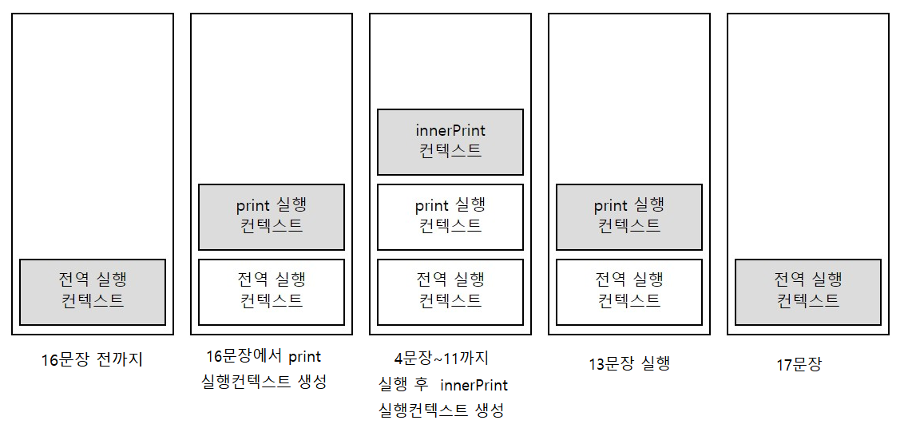
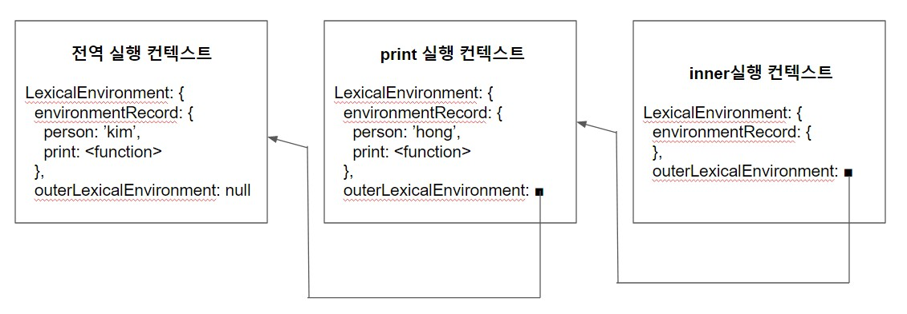
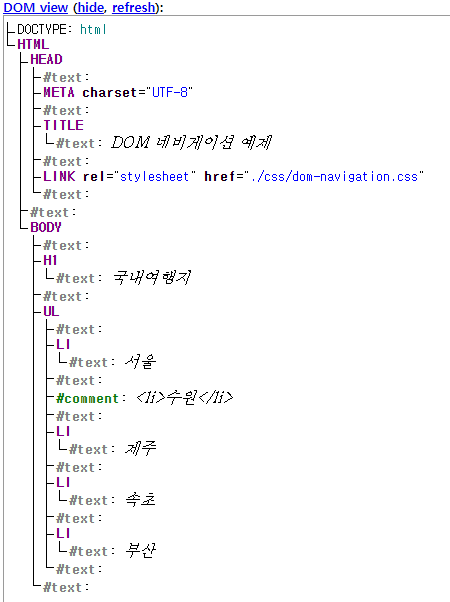
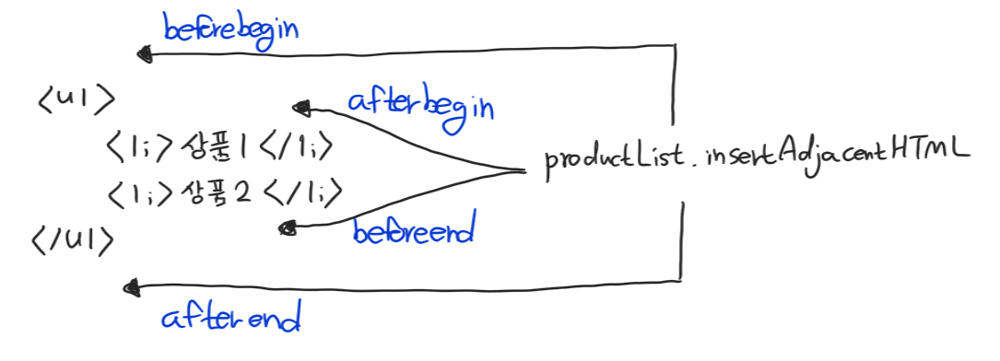

# part2                                          
## 자료형 변환

* 형변환 방법
  1. 개발자가 직접 명시적으로 자료형을 변환
  2. 자바스크립트 엔진에 의해 자동으로 자료형을 변환
     * 자바스크립트가 동적 자료형 언어이기 떄문에 적용되는 특징
     * 개발자가 어떤 의도로 코드를 작성해도 자바스크립트 맘대로 바꾸느니라

* `연산자`를 활용한 자료형 변환

  * `덧셈`: 대입되는 값에 따라 `숫자형` 또는 `문자형`으로 바뀐다.

    ```javascript
    var str = 5 + '1'
    console.log(str) // 51, type: string
    num = +str 
    console.log(num) // 51, type: number
    ```

  * `뺄셈`, `곱셈`, `나눗셈` : 항상 `숫자형`을 반환

    ```javascript
    console.log('5' * 2) // 10, type: number
    console.log('Five' * 2) // NaN, type: number
    ```

## 객체

### 객체 길이 구하기 - Object.keys().length

>  `배열`의 길이는 `.length` 로 간단하게 구할 수 있어 `객체`에도 동일하게 적용해보면 길이가 안나온다.

```javascript
var obj = {객체객체}
Object.keys(obj).length 
```

* Object.keys()를 하면 키가 `배열`로 반환된다.

## 비구조화 할당

### 객체 비구조화 할당

```javascript
var obj = {a:1, b:2, c: 30, d: 44, e:5}

var {a, c} = obj
console.log(`a >>> ${a}`) // a >>> 1
console.log(`c >>> ${c}`) // c >>> 30

var {a:newA=10, f:newF=5} = obj
console.log(`newA >>> ${newA}`) // newA >>> 1
console.log(`newF >>> ${newF}`) // newF >>> 5
```

1. `var {a, c} = obj`
   * 비구조화 할당을 통해 a, c를 obj에서 가져와서 할당한다.
2. `var {a:newA=10, f:newF=5} = obj`
   * `a`와 `f`를 `newA`와 `newF`라는 새로운 변수로 할당한다.
   * `obj`에 있는 `a`값인 1을 가져오고, `f`는 없으므로 기본값으로 설정한 5가 `newF`가 된다.

### 배열 비구조화 할당

```javascript
var arr = [1, 2, 30, 44, 5]

var [a=10,f=9] = [1]
console.log(`a >>> ${a}`) // a >>> 1
console.log(`f >>> ${f}`) // f >>> 9

[a, , , , , f] = [1, 2, 3, 4, 5, 6]
```

1. `var [a=10,f=9] = [1]`
   * `객체 비구조화 할당`과 마찬가지로 `기본값`을 지정해둘 수 있다.
2. `[a, , , , , f] = [1, 2, 3, 4, 5, 6]`
   * `콤마` 사이를 비워 중간 요소를 무시할 수 있다.

## Symbol

* 이름의 충돌 위험이 없는 유일한 객체의 프로퍼티 키를 만들기 위해 사용한다.
* 필요할 떄 [다시 읽어보는 거로 하자..](https://poiemaweb.com/es6-symbol)

## 예외처리

### throw
* 개발자가 의도한 에러 발생
* 고의로 에러를 발생시켜 예외 상황을 `알리는` 역할을 한다.
* `throw` 문은 예외 상황을 `미리 파악`하고 에러를 발생시켜 이후 코드가 `실행되지 않도록 합니다.`
* `throw`의 에러 발생시 코드가 멈추는 점에 대한 대응책이 `try-catch-finally`

### try-catch-finally


* 예상치 못한 에러 , 의도한 에러 모두 대응 가능.
* `try`문 안에서 발생된 에러 정보를 `catch`블록으로 전달.

  * `throw` 문에서 정의한 에러가 전달된다.
  * 예제의 경우 '유효하지 않은 값입니다.' 가 `catch`문으로 전돨된다

* `finally` 에러 여부와 상관없이 `항상` 실행.

## arguments

|          매개변수          |     전달 인자(argument)      |
| :------------------------: | :--------------------------: |
| 함수 선언 시 작성되는 변수 | 함수가 호출될 때 전달되는 값 |

* 자바스크립트는 전달 인자의 개수와 매개변수의 개수가 달라도 에러를 발생하지 **않는다.**

* 함수에서만 사용 가능한 특별한 객체를 제공하는데 그게 바로 `arguments 객체`

* `arguments 객체`는 `배열`과 유사하게 인덱스를 통해 접근이 가능하고 `length` 속성을 가지고 있지만 배열이 **아니고** 배열의 다른 속성이나 매소드를 가지고 있지 않다.

  * `인덱스`를 통한 접근이 가능하지만, 배열의 다른 메소드들을 가지고 있지 않기 떄문에 `indexOf()`와 같은 메소드를 사용하면 에러가 발생한다.

* `arguments`를 `배열` 로 바꾸는 방법

  ```javascript
  let newArr = Array.prototype.slice.call(arguments)
  ```

  * 이렇게 배열을 만들 수도 있겠지! 굳이 그럴필요는 없지만..

    ```javascript
    function list() {
        return Array.prototype.slice.call(arguments)
    }
    var myList = list(1, 2, 3, 4, 5) // [1, 2, 3, 4, 5]
    ```

    > call 에 대한 설명은 [이곳]([https://velog.io/@rohkorea86/this-%EC%99%80-callapplybind-%ED%95%A8%EC%88%98-mfjpvb9yap](https://velog.io/@rohkorea86/this-와-callapplybind-함수-mfjpvb9yap))을 참조하여 더 공부해보자.

## 기본 매개변수 (ES6)

* 함수를 정의할 때 `매개변수 = 값`을 통해 기본값을 정의해줄 수 있다.

## 나머지 매개변수 (ES6)

```javascript
function sum(...args) {
    var total = 0
    for (var i = 0; i < args.length; i++) {
        total += args[i]
    }
    console.log(args.indexOf(i))
    return total
}
```

* `arguments` 객체와 비슷하지만 `나머지 매개변수`는 `배열`이기 떄문에 `인덱스`를 통한 접근뿐 아니라 `indexOf()`와 같은 메소드 사용도 가능하다.

## 스코프 

`스코프`는 유효 범위로써 변수와 매개변수가 어디까지 유효한지를 나타낸다.

* 접근 범위에 따른 분류
  1. `전역 스코프` - 코드 어디에서든 접근 가능
  2. `함수 스코프` - 해당 함수 블록 안에서만 접근 가능

```javascript
function print() {
    var b = 20
    if (true) {
        var c = 30
    }
    console.log(c) // if문 블록 밖에서 블록 안에 있는 c에 접근했다.
    			   // var는 함수 스코프에 정의되기 때문에 print()함수 내에 있는 c에도 접근 가능
}
print()
console.log(b)	// 에러
```

* 시점에 따른 분류
  1. `렉시컬 스코프` - 코드를 작성하는 시점에 스코프가 결정되어 `정적 스코프`라고 부르며 **자바스크립트는 대표적인 렉시컬 스코프이다.**
  2. `다이나믹 스코프` 

```javascript
var a = 'global'
function print1() {
    console.log(a)
}
function print2() {
    var a = 'local'
    print1()
}
print1()
print2()
```

> 결과는 무엇일까요~?

자바스크립트는 `렉시컬 스코프`이기 때문에 코드를 **작성하는 시점**에 확정된다. 그래서 print1이 **작성**될 떄에는 이미 전역 a를 참조하고 있기 때문에 문자열 `global`이 출력된다!!

## 함수 호이스팅

> 자바스크립트에서는 함수를 선언하기 전에 호출이 가능하고 이러한 현상을 호이스팅이라고 한다.

```javascript
hello()  // 안녕하세요  - 적상 작동한다.
function hello() {
    console.log('안녕하세요')
}
```

```javascript
hello2() // 에러!!! - TypeError: hello2 is not a function
var hello2 = function() {
    console.log('안녕하세요')
}
```

* 두번째 코드는 왜 에러가 뜨고, 에러의 종류가 `TypeError`일까?
  * hello2 이름으로 선언된 변수는 호이스팅이 이루어졌다. 다만 `undefined`가 할당되었기 떄문에 **호출** 할수가 없어 `TypeError`가 뜬 것이다.
  * 호이스팅 자체가 이루어지지 않았다면 에러 종류가 `ReferenceError`로 hello2가 선언되지 않았다는 에러가 나와야 한다.

### :lipstick: 함수호이스팅 - 에러 발생의 이유

```text
호이스팅은 자바스크립트의 코드를 1.해석하고 2.실핼하는 방식 때문에 나타납니다.
간단하게 생각하면 자바스크립트는 코드를 해석하는 단계와 실행하는 단계로 나뉘고,
1.해석하는 단계에서 선언 문장을 초기화 하면서 스코프를 형성하고
2.실행하는 단계에서 값을 할당하거나 계산을 하는 행위를 한다고 볼 수 있습니다.

그렇기 때 문 에!!

해석 단계에서 hello2 변수를 선언하는 문장이 먼저 *초기화*를 하여 스코프에 hello2라는 이름에 undefined라는 값을 할당했다가
실행 단계에서 (아직 hello2에 함수가 할당되기 전에) hello2를 함수로 호출하는 바람에 Type에러가 발생하게 되는 것입니다.
```

## 변수선언

### let

```javascript
if (true) {
    var functionScopeValue = 'global'
    let blockScopeValue = 'local'
}
console.log(functionScopeValue) // global
console.log(blockScopeValue) // ReferenceError
```

> let은 블록 단위 유효 범위를 가지게 되어 if문 밖에서 접근했을 경우 ReferenceError가 발생한다.

```javascript
let value = '바깥값'
if (true) {
    console.log(value)
    let value = '안쪽값'
}  // ReferenceError
```

> let으로 선언한 변수는 호이스팅이 블록 단위로 일어난다.
>
> 하지만 var와는 다르게 undefined값이 할당되기보다는 블록 시작부터 선언이 이루어진 라인까지 일시적으로  접근을 막는다.
>
> 블록안의 let 코드가 없었다면 위의 코드는 '바깥값'이 출력되었을 것이다.
>
> 하지만 if 블록 안에서 let으로 변수를 정의하였기 때문에 value는 if 블록문 안에 위쪽으로 호이스팅되어 실제 let으로 선언이 이루어지기 전까지 일시적으로 접근이 안 되는 영역을 만들고 그 안에서 접근을 하게 되면 에러가 발생하는 것이다.

### const

* `const`는 `let`과 마찬가지로 블록 단위 스코프를 가진다.
* `let`과는 다르게 **선언시** 값을 할당해야 하고 **재할당이 불가능하다**
* 관례적으로 변하지 않는 값을 정의하기 때문에 변수를 **대문자**로 작성한다.

```javascript
const URL = 'http://js.com'
URL = 'https://js.com' 		 // TypeError

if (true) {
    const URL2 = 'http://js.com'
}
console.log(URL2)   		 // ReferenceError
```

> **재할당이 불가능**하기 때문에 에러, **블록 단위 스코프**이기 떄문에 발생하는 에러

* `const`를 사용했다고 해서 무조건 변경이 안되는 것은 아니다.
  * `const`를 사용하여 개체를 할당했다고 하여 그 객체가 `불변 객체(Immutable Object)`가 되지는 않는다.

```javascript
const CONST_USER = {name: 'kim', age: 29}
console.log(CONST_USER.name, CONST_USER.age)  // 정상 출력

CONST_USER.name = 'tae'  
CONST_USER.age = 30
console.log(CONST_USER.name, CONST_USER.age)  // 정상 출력

CONST_USER = {name: 'woo'}  				  // TypeError
```

> const 로 정의된 CONST_USER는 불변 객체가 아니라서 각 속성에 다른 값을 할당하는 것이 가능하다.
>
> 즉, 객체의 내부 상태가 변경 가능하기 때문에 const로 배열을 선언하여도 새로운 요소를 추가하거나 변경할 수 있다.
>
> 하지만, 재할당은 불가능 하기에 새로운 객체나 배열을 재할당하려하면 에러가 발생한다.

## 스코프체인 이해하기 (이론) - 다시 좀 읽어보자...

> 함수 안에 함수를 선언한 중첩 함수에서 자식 함수가 부모 함수의 변수에 어떻게 접근 가능한지에 대해 알아보자.

* 스코프체인 - 문자 그대로 스코프가 연결되어 있음을 뜻한다.

### 실행 컨텍스트, 렉시컬 환경

> 스코프 체인을 이해하기 위해서는 `실행 컨텍스트`와 `렉시컬 환경`에 대한 이해가 필요하다.

* `실행 컨텍스트(Execution Context)` - 코드가 실행되기 위해 필요한 정보를 가지고 있으며 실행 가능한 코드가 실행될 때 생성된다. 대표적인 실행 가능한 코드로는 `전역 코드`와 `함수 코드`가 있다. (eval과  모듈 코드도 있다)
  * 처음에는 전역 코드가 먼저 실행됩니다. 이떄 `전역 컨텍스트`를 만들고 전역 코드를 순차적으로 평가합니다. 그러다 함수가 호출문을 만나면 새로운 `실행 컨텍스트`가 만들어지면서 해당 함수 실행부의 코드를 순차적으로 평가합니다. 이때 `스택`을 이용해 `실행 컨텍스트`를 관리하게 되는데, 새로운 `실행 컨텍스트`가 생성되면 스택에 쌓고 실행 중인 코드가 종료되면 해당 `실행 컨텍스트`를 스택에서 제거합니다.

```javascript
var person = 'kim'
function print() {
    var person2 = 'hong'
    function innerPrint() {
        console.log(person)
        console.log(person2)
    }
   	innerPrint()
    console.log('print finished')
}
print()
console.log('finished')
```

>kim
>
>hong
>
>print finished
>
>finished

* 위 코드에 대한 실행 컨텍스트가 실행될 떄 시간에 따라 어떻게 스택에 쌓이고 제거되는지를 확인해보자.



* `실행 컨텍스트`는 `렉시컬 환경`을 가지고 있는데, 렉시컬 환경은 `환경 레코드(EnvironmentRecord)`와 `외부 렉시컬 환경(OuterLexicalEnvironment)`으로 구성됩니다. 실행 컨텍스트를 자바스크립트 객체 형태로 표현하면 다음과 같습니다.

  ```javascript
  ExecutionContext = {
      LexicalEnvironment: {
          EnvironmentRecord: {
              
          },
          OuterLexicalEnvironment: 참조
      }
  }
  ```

  * 실제 함수와 변수같은 식별자와 그 식별자가 가리키는 값은 키(key)와 값의 쌍르호 `환경 레코드`에 기록됩니다. 그리고 렉시컬 환경은 환경 레코드 외에 다신의 실행 환경을 감싸는 외부 실행 환경에 대한 참조를 깆고 있습니다.

* 위 코드의 실행 컨텍스트와 내부 렉시컬 환경을 그림으로 나타내면 다음과 같습니다.



* 각 `식별자`는 `outerLexicalEnvironment`로 체인처럼 연결되어 있습니다. 이렇게 각 렉시컬 환경이 연결되어 있기 때문에 스코프 체인이 형성될 수 있습니다. 위 예제코드에서 스코프 체인으로 식별자를 찾는 문장을 살표보겠습니다
* innerPrint함수가 호출될 때 두 변수 person과 person2, 즉 각 식별자는 연결된 값을 자신의 실행 컨텍스트의 렉시컬 환경에서 찾습니다. 하지만 person과 person2는 innerPrint함수 내에 선언되지 않았습니다. 그러면 위 그림처럼 inner 실행 컨텍스트의 환경 레코드에는 아무런 키-값의 쌍이 없게 됩니다.
* 이렇게 자신의 실행 컨텍스트에 없으면 외부 렉시컬 환경의 참조를 통해 연결된 print 실행 컨텍스트에서 해당 식별자는 찾게 됩니다. 이때 person을 print 실행 컨텍스트의 환경 레코드에서 찾아서 'hong'을 출력하게 됩니다. 마찬가지로 person2는 전역 실행 컨텍스트까지 가서 찾아 값을 출력합니다.

## 클로저 이해하기(이론) - 다시 좀 읽어보자..

> 자바스크립트에서 클로저가 어떻게 생성되고 활용되는지

```javascript
function createCounterClosure() {
    let count = 0
    return {
        increase: function() {
            count++
        },
        getCount: function() {
            return count;
        }
    }
}

const counter1 = createCounterClosure()
const counter2 = createCounterClosure()

counter1.increase()
counter1.increase()
console.log(`counter 1의 값: ${counter1.getCount()}`)  // 2
counter2.increase()
console.log(`counter 2의 값: ${counter2.getCount()}`)  // 1
```

* `createCounterClosure()` 함수는 `객체`를 반환하는데 객체는 increase와 getCount 메소드가 있고, 모두 count 변수에 접근합니다.
* `counter`과 `counter2` 객체의 increase 메소드를 호출하면 createCounterClosure 함수 내부의 count 변수에 모두 접근합니다. 하지만 두 객체의 getCount를 호출한 결과를 보면 `counter1`과 `counter2`가 가리키는 `count`가 다른 값을 가지고 있는 것을 알 수 있습니다.
* 두 counter 객체가 다른 count에 접근하는 것은 다른 `렉시컬 환경`의 `환경 레코드`에서 count에 접근하는 것입니다. 이러한 현상이 가능한 이유는 바로 클로저 떄문입니다.

> `클로저`란 함수가 정의될 때의 렉시컬 환경을 기억하는 함수를 말합니다.

* `increase`와 `getCount` 함수가 정의될 떄의 렉시컬 환경은 `creaseCounterClosure` `실행 컨텍스트`의 `렉시컬 환경`입니다. 이 `실행 컨텍스트`는 13, 14 라인에서 각각 생성됩니다. 그래서 increase 함수와 getCOunt 함수는 createCounterClosure `실행 컨텍스트`의 `렉시컬 환경`을 기억하고 있는 `클로저`가 됩니다.
* 대체로 `실행 컨텍스트` 가 `컨텍스트 스택`에서 제거되면 해당 환경은 사라지기 마련인데 위 예제처럼 클로저가 ㅁ나들어지면 해당 환경은 사라지지 않습니다. 왜냐하면 해당 참조가 존재하기 떄문입니다(예제는 counter1과 counter2가 전역 변수에 할당되어 참조가 존재합니다.)

**이해가 잘 안되니 더 공부해보도록 합시다...**

## 객체 속성 기술자 이해하기

> 자바스크립트의 모든 객체 `속성`은 자기 자신에 대한 정보를 담고 있는 `속성 기술자`를 가지고 있고 이 속서 기술자는 객체로 표현된다.

* `getOwnPropertyDescriptor(객체, '속성')` - 속성 기술자 객체를 가져온다.
* `Object.defineProperty(객체, '속성', 옵션)` - 해당 객체의 속성을 정의한다.
  * `value` : 해당 속성의 `값`을 나타낸다.
  * `enumerable` : `for...in` 루프나 `Object.keys`메소드같이 속성을 나열할 떄 나열 가능 여부를 정의한다. false일 경우 해당 속성은 나열되지 않는다.
  * `writable` : 값을 변경할 수 있는 여부를 정의한다. false일 경우 값이 변하지 않는다.
  * `configurable` : 속성 기술자를 변경할 수 있는 여부를 정의한다. false일 경우 속성 기술자를 다시 변경할 수 없다.

* 위의 옵션처럼 **데이터에 대한 정보**를 정의하는 것 외에도 `get`, `set`을 통해 **데이터에 접근하는 방법**을 정의할 수도 있다. 

## Get, Set을 통한 속성 접근 관리하기

* `get` - 속성에 `접근`할 때 호출된다.
* `set` - 속성에 값을 대입할 때 호출된다.

```javascript
let user = {}

Object.defineProperty(user, 'age', {
    get: function () {
        return this._age
    },
    set: function (age) {
        if (age < 0) {
            console.error('0보다 작은값은 올 수 없습니다.')
        } else {
            this._age = age
        }
    },
    enumerable: true
})
user.age = 10  // user.age에 10을 대입 -> set 메소드 호출되고 user._age에 10이 할당.
console.log(user.age)  // age 속성에 접근 할때 get이 출되어 this._age가 반환되어 출력
user.age = -1  // set 메소드 호출, 0보다 작은 값을 대입하려하여 에러 발생.

let user2 = {
    get name() {  //  이렇게 객체를 정의할 때 메소드를 정의하는 메소드명 앞에 get, set 정의가능
        return this._name
    },
    set name(val) {
        if (val.length < 3) {
            throw new Error('3자 이상이어야 합니다.')
        }
        this._name = val
    }
}
user2.name = 'harin'
console.log(user2.name)
user2.name = 'han'
```

> user._age 와 같이 속성 이름 앞에 _를 붙이는 것은 암묵적으로 비공개(Private) 속성임을 나타냅니다. 자바스크립트 객체는 속성 접근 제한자가 없어서 모든 속성은 공개입니다. 그래서 대체로 이름 규칙을 통해 비공개임을 나타냅니다.

## 화살표 함수 (ES6)

> function 키워드 대신 => 연산자를 이용하여 함수를 정의할 수 있다.

* 화살표 함수 규칙
  1. 매개변수가 하나일 경우에는 인자를 정의할 떄 괄호를 생략할 수 있습니다.
  2. 매개변수가 없거나 둘 이상일 경우 괄호를 작성해야 합니다.
  3. 화살표 함수 코드 블록을 지정하지 않고 한 문장으로 작성 시 return 문을 사용하지 않아도 화살표 오른쪽 표현식의 계산 결과값이 반환됩니다.
  4. 화살표 함수 코드 블록을 지정했을 경우 반환하고 하는 값에 return 문을 작성해야 합니다. return문이 없을 시 **undefined**가 반환됩니다.
* 화살표 함수는 `arguments`객체가 만들어지지 않습니다.
  * arguments 객체가 필요한 경우 `나머지 매개변수 (...args) ` 사용을 권합니다.

## 객체지향 프로그래밍

* `객체지향 프로그래밍`이란, **프로그램을 객체들로 구성하고 객체들 간에 서로 상호작용하도록 작성하는 방법**

* 객체지향에서의 `객체`란, 식별 가능한 구체적인 사물 또는 추상적인 개념

* `객체`는 **특징적인 행동**과 **변경 가능한 상태**를 가진다.
  * 함수 값을 가지는 속성인 `메소드`가 특징적인 행동이며,
  * 그 외에 다른 값들은 변경 가능한 상태라 볼 수 있다.

```javascript
// 객체지향 프로그래밍
const teacherJay = {
    name: '제이',
    age: 30,
    teachJavascript: function(student) {
        student.gainExp()
    }
}
const studentBbo = {
    name: '뽀',
    age: 20,
    exp: 0,
    gainExp: function() {
        this.exp++
    }
}

console.log(studentBbo.exp)
teacherJay.teachJavascript(studentBbo)
console.log(studentBbo.exp)
```

> teachJavascript 메소드는 학생을 매개변수로 정의하고 있다. 즉, teacherJay 객체는 student 객체를 사용한다.

* 자바스크립트는 `프로토타입 기반`으로 객체지향 프로그래밍을 지원한다.  자바의 클래스 기반과의 큰 차이점으로 `프로토타입`으로 `객체`에 공통 사항을 적용할 수 있습니다.
* 즉, 모든 객체는 `원형(Prototype)`이 될 수 있다. 

```javascript
// 객체지향 프로그래밍 - 프로토타입
const studentProto = {
    gainExp: function() {
        this.exp++
    }
}
const harin = {
    name: '하린',
    age: 10,
    exp: 0,
    __proto__: studentProto
}
const bbo = {
    name: '뽀',
    age: 20,
    exp: 10,
    __proto__: studentProto
}
bbo.gainExp()
harin.gainExp()
harin.gainExp()
console.log(harin)
console.log(bbo)
```

> gainExp 메소드를 가지는 객체를 정의하고 다른 객체에 proto 속성으로원형 객체를 정의(연결)해준다.

* \_\_proto\_\_ 속성에 다른 객체를 할당하지 않으면 기본적으로 `Object.prototype`객체가 연결되어 있다.

## 생성자 함수 이해하기

* 자바스크립트에서 `함수`는 재사용 가능한 코드의 묶으로 사용하는 것 외에 **객체를 생성하기 위한 방법**으로도 사용됩니다.
* 객체를 생성하기 위해 직접적으로 객체를 반환해도 되지만, `new`키워드를 사용하여 함수를 호출하게 되면 **return문 없이도 새로운 객체가 반환됩니다.** 그리고 함수 바디에서 `this`키워드를 사용하여 반환되는 객체의 초기 상태와 행위를 정의할 수 있습니다.
* **생성자 함수**는 `new` 키워드를 사용하지 않으면 일반적인 함수와 동일하게 동작하며 새로운 객체를 반환하지 않습니다. 
* 그렇기 때문에 생성자 한수는 함수명을 **대문자**로 시작하는 관례를 가집니다.

```javascript
function Teacher(name, age, subject) {
    this.name = name
    this.age = age
    this.subject = subject
    this.teach = function (student) {
        console.log(`${student}에게 ${this.subject}를 가르칩니다.`)
    }
}
const jay = new Teacher('jay', 30, 'JavaScript')
console.log(jay)
jay.teach('bbo')

console.log(jay.constructor)
console.log(jay instanceof Teacher)

const jay2 = Teacher('jay', 30, 'Python')
console.log(jay2)
console.log(age)
```

* Teacher 함수는 return문이 없지만 new키워드로 인해 객체를 반환하게 된다. 이때 반환되는 새로운 객체를 가리키는 것이 this이다
* 모듣 객체는 `constructor` 속성을 가지고 이 속성은 객체를 만든 생성자 함수를 기르킨다. jay 객체는 Teacher 생성자 함수를 가리키게 된다.
* `new` 키워드를 뺴고 Teacher 함수 호출시 생성자 함수의 `this`는 **전역 객체**를 가르키게 된다. 그래서 console.log(age)에서 전역 변수 age를 참조하여 30이 출력되게 된다. 새로운 객체를 반환하지 않았기 떄문에 jay2는 undefined가 출력된다.

* 생성자 함수의 `new`호출을 통한 객체 생성 과정

  ```text
  1. 빈 객체를 만듭니다.
  2. 만든 빈 객체를 this에 할당합니다.
  3. 생성자 함수 바디의 코드를 실행합니다(this에 속성 및 메소드 추가)
  4. 만든 빈 객체의 __proto__에 생성자 함수의 prototype 속성을 대입합니다.
  5. this를 생성자의 반환값으로 변환합니다.
  ```


## 프로토타입 기반 상속 이해하기

* 다시 읽어보자...;;;

## 클래스

### 클래스 정의하기 (ES6)

> ES6에서 추가된 class 키워드를 통해 클래스를 어떻게 정의하고 사용하는지 알아보자. [코드](./part2/051.js)

### 클래스 상속 이해하기 

> 클래스 상속에 대해 알아보자.[코드](./part2/052.js)

### 클래스 정적 메소드와 속성 정의하기

> 일반적인 메소드는 해당 클래스의 인스턴스를 통해 호출합니다.
>
> 반면 정적 메소드는 클래스를 통해 직접 호출하는 메소드를 말합니다.
>
> 클래스에서 정적 메소드는 static 키워드를 사용항여 정의합니다. [코드](./part2/053.js)

## this 이해하기

* `this`는 함수가 어떻게 호출되는지에 따라 동적으로 결정된다. -> 동적으로 생성되다보니 실수가 많다.
* `this`는 전역에서 사용할 수도 있고 **함수**에서도 사용할 수 있는데, **함수**는 **객체 안의 메소드로 정의**될 수도 있고 **생성자 함수**로 사용될 수도 있고 **특정 로직을 계산하여 값을 반환하는 목적**으로 사용할 수도 있다.
* 이렇게 **함수**가 다양하게 사용되다 보니 `this`도 각 함수별로 다르게 해석된다...!!
* `class`안에서 사용되는 `this`는 생성자 함수와 동일하다.

---

* 브라우저 환경 전역에서 사용시 : Window 객체
* 함수에서 this 사용 후 함수 호출 : Window 객체
* 생성자 함수의 this -  `new` 키워드없이 사용 : 일반 함수와 마찬가지로 Window 객체
* 생성자 함수의 this - `new`키워드 사용 : 프로포타팁 객체와 연결된 객체
* 메소드 안에서 this정의 후 다른 변수에 메소드 저장 후 그 변수를 통해 호출 : 일반 함수와 마찬가지로 전역 객체. 즉, 호출하는 시점에 점(.) 연산자와 함께 객체가 주어져야 메소드 안의 this가 호출의 주체인 객체가 된다.
* this 는 `bind` 메소드를 통해 전달한 인자값으로 변경 가능.
* 메소드 안에서 **중첩 함수로 함수가 작성됐을 때** 내부 함수의 this :  전역 객체를 가리킨다.
* `화살표 함수`에서 this : 부모 환경의 this를 가리킨다. 그래서 중첩된 함수로 작성되었을 떄 화살표 함수를 사용하면 화살표 함수는 부모 함수의 this와 같다.

---

* 화살표 함수와 bind 가 자바스크립트에 추가되기 전에 대체로 this에 대한 레퍼런스를 다른 변수에 보관하였다가 내부 함수에서 그 변수를 참조하는 방식으로 메소드를 소유한 객체에 접근하였다.

  ```javascript
  // 화살표함수, bind가 없던 시절
  const counter1 = {
      count: 0,
      addAfter1Sec() {
          const me = this
          setTimeout(function() {
              me.count += 1
              console.log(this.count)
          }, 1000)
      }
  }
  counter1.addAfter1Sec()
  ```

* 화살표 함수에서 this는 일반적인 this와 다르게 호출 시점에 동적으로 정의되는 것이 **아니라** 코드를 `작성하는 시점에 정적으로 결정`됩니다. 화살표 함수를 작성하는 시점의 부모 환경에서의 this로 정의되고 변경이 불가능합니다. **즉, 다음과 같이 bind를 통해 this를 변경할 수 없습니다.**

  ```javascript
  const arrowFunc = () => {
      console.log(this)
  }
  const nowArrowFunc = arrowFunc1.bind({d:2})
  nowArrowFunc() // Window 전역 객체가 콘솔에 출력된다.
  ```

## 모듈

### 모듈 이해하기

* `모듈`은 파일이나 코드의 묶음 단위로 애플리케이션 하나의 구성요소로 볼 수 있다. 모듈 단위로 코드를 재사용 할 수 있고, 하나의 애플리케이션이라는 큰 기능을 작은 기능 단위로 잘게 분리하여 관리할 수 있다.
* ES6 이전에는 모듈에 대한 정의를 자바스크립트 표준으로 제공하지 않아기때문에 네임스페이스 패턴을 통해 모듈을 정의했다.

### 모듈 시스템 이해하기 (ES6)

* ES6의 `모듈`은 자바스크립트 코드를 담고 있는 하나의 파일이다.
* `export` 키워드를 이용하여 모듈 내의 특정 코드를 외부에서 사용할 수 있고 `import` 키워드를 이용하여 `export`한 코드들을 가져올 수 있습니다.
* 하나의 모듈이 다른 모듈에서 내보낸(Export) 코드를 가져오면(Import) 두 모듈은 서로 의존관계까 형성되고 의존 그래프가 형성된다. 그리고 의존 관계 그래프에서 최상위 루트가 필요한데 이 루트 모듈이 어플리케이션의 시작 지점이 된다. [예제](./part2/056/index.html)에서는 `app.js`가 류트 모듈이라 할 수 있다.

#### ES6에서 모듈을 실행하는 두가지 방법

1. `런타임 로딩(Runtime Loading)` : 의존 관계가 형성된 모듈들을 어플리케이션 구동 시점에 HTTP요청으로 불러오고 실행합니다. 이때 **모듈 로더**가 필요한데 `system.js`나 `require.js`를 이용할 수 있다.

   ```text
   system.js는 다양한 모듈 형식을 지원하는 모듈 로더입니다. ES6 모듈 형식 외에 require.js, CommonJS등 다양한 포멧을 지원합니다. 뿐만 아니라 system.js 자체 포맷 또한 제공하고 있습니다.
   ```

2. `번들링(Bundling)` : 의존 관계가 형성된 모듈들을 **하나의 파일로 묶어줍니다.** 그리고 어플리케이션이 구동할 떄 묶여진 이 파일을 로드합니다. 번들링은 개발 시점에 이루어지게 되고 브라우저에서 이루어지지 않고 대체로 `node.js` 환경에서 이루어지게 됩니다. 대표적 모듈 번들러로는 `웹팩(Webpack)`이 있습니다.

   ```text
   웹팩은 모듈 번들러로 자바스키립트 코드 외에 CSS, 이미지, 폰트 등 다양한 자원들을 모듈화시켜 의존관계 그래프를 형성하여 병합된 파일들을 만들 수 있습니다. node.js 플랫폼에서 동작하는 애플리케이션이고 다양한 플러그인들을 제공하고 있습니다.
   ```

3. 크롬61 버전부터 \<script typ=module\>을 지원하면서 별도의 모듈 로더 없이 ES6 모듈을 사용할 수 있다.

### 모듈 기본값 정의하고 가져오기(ES6)

> ES6에서 모듈을 정의할 때 기본값으로 정의하고, 정의된 값을 다른 모듈에서 어떻게 불러오는지 알아보자

* ES6 모듈 시스템에서는 `default` 키워드를 사용하여 모듈에서 기본으로 내보내는 값을 정의할 수 있다.
* `숫자`, `문자`, `불리언` 같은 기본형 값과 `객체`, `함수`, `클래스` 같은 참조형 값 모두 올 수 있다.

* `default` 키워드는 하나의 모듈에서 한 번만 사용할 수 있습니다.
* `default` 키워드 다음에 `var`, `let`, `const` 같은 변수선언 키워드를 쓸 수 없다.

### 모듈을 여러 이름으로 내보내고 가져오기(ES6)

> ES6에서 모듈을 정의할 떄 이름있는 변수, 함수 클래스들을 내보내고 이렇게 내보낸 것들을 다른 모듈에서 어떻게 불러오는자 알아보자.

* ES6 모듈 시스템에서는 이름있는 변수나 함수 혹은 클래스를 `export` 키워드를 사용하여 내보낼 수 있습니다.

* export

  1. export 키워드 각각 붙이기

     ```javascript
     export const version = 'v1.0'
     export var personA = {
         name: 'a'
     }
     export function add(a, b) {
         return a + b
     }
     export class Person {
         constructor(name) {
             this.name = name
         }
     }
     ```

  2. 선언 후에 한꺼번에 export

     ```javascript
     class Person {
         constructor(name) {
             this.name = name
         }
     }
     const version = 'v1.0'
     export Person // 문법 오류
     export {version, Person} // 한개를 보낼 떄도 {} 안에 나열해야한다.
     ```

* import

  ```javascript
  import {add, Person, version} from './hello.js'
  ```

  * `{}`안에 `,` 로 구분하여 불러온다.

  * 다른 모듈에서 가져온 이름은 오직 `읽기`만 가능합니다. 해당 이름에 다른 값을 할당할 수 없습니다.

    ```javascript
    import { personA } from './hello.js'
    personA = 'v2' // 오류 발생
    ```

### 모듈을 다양한 방식으로 사용하기

* `as` : 모듈을 다른이름으로 불러오거나 내보낼 수 있습니다.

  * 불러오기

    ```javascript
    import { version as moduleVersion } from './version.js'
    ```

    > version 을 moduleVersion 이라는 이름으로 불러오고 사용가능.

  * 내보내기

    ```javascript
    const version = 'v1.0'
    export { version as ver }
    ```

    > 선언된 이름들을 마지막에 export할 때 위와 같이 as키워드로 다른 이름으로 내보낼 수 있고
    >
    > 가져올 떄도 ver 이름으로 가져올 수 있다.

* `*`로 모두 가져오기, 다른 모듈의 코드를 실행만 시키기

  ```javascript
  // add.js
  export default function add(a, b) {
      return a + b
  }
  export const version = 'v1.0'
  ```

  * add 함수를 모듈의 기본으로 정의합니다. 그리고 version 변수를 내보냅니다.

  ```javascript
  // sideeffect.js
  console.log('hello!')
  window.hello = function hello(name) {
      console.log('hello' + name)
  }
  ```

  * 외부로 내보내는 값 없이 전역객체인 window에 메소드로 hello를 선언. window에 메소드를 추가하면 window를 통하지않고 직접 해당 메소드 호출이 가능하다

  ```javascript
  // app.js
  import * as add from './add.js'
  import './sideeffect.js'
  import Hello from '../057/hello.js'
  
  console.log(add.version)
  const added = add.default(1, 2)
  console.log(added)
  
  hello('harin')
  ```

  * ` add.js` 모듈을 `*`를 이용하여 전체를 가져옵니다. 이떄 가져온 모듈 전체를 기리키는 이름이 있어야 하기 떄문에 `as`를 사용하여 이름을 주었다.
  * `sideeffect.js` 모듈을 **실행**한다. from 키워드 없이 작성하였기 떄문에 실행만 할뿐 어떤 것도 가져오지 않는다. 따라서 hello! 가 출력되고 전역에 hello 라는 함수가 선언된다.
  * `add`라는 이름으로 `add.js`모듈을 가리키기 때문에 `add`는 모듈 객체이고 속성으로 `defualt`와 `version`이 있다.
  * `hello` 함수는 전역에 선언되었기 떄문에 다시 실행이 가능하다.

* 다른 모듈에서 가져온 값들은 복제되는 것이 아니라 이름과 연결된 그 자체를 가져오게 된다. 즉, 내보낸 모듈에서 값을 변경하게 되면 가져온 모듈에서도 영향을 받게 된다.

  ```javascript
  // value.js
  export let value = 1
  setTimeout(() => {
      value++
  }, 1000)
  ```

  * 1초 뒤에 value에 1을 더한다.

  ```javascript
  // app3.js
  import {value} from './value.js'
  console.log(value)
  setTimeout(() => console.log(value), 2000)
  ```

  * 처음 1이 출력되고 2초 후에 다시 출력을 하니 2가 출력된다.
  * 가져온 모듈에서 value값이 변경되었기 때문이다.
  * 값이 복제되는 것이라면 2초뒤에도 그대로 1이 복사되었을 것이다.

# part3

## 표준 내장 객체 이해하기

> [코드](./part3/060.js), [코드-1](./part3/060-1.js)

* 몇몇 `표준 내장 객체`는 객체임에도 불구하고 함수처럼 호출할 수 있고 이러한 형태를 `내장 함수 객체(Built-in Function Object)`라고 한다. 
* `new` 지시자를 사용하여 함수 형태로 호출하며, `생성자(Constructor)`를 생성합니다. 
* `Math`, `Date`, `JSON`과 같은 객체는 선언없이 객체의 메소도와 속성을 바로 가져다 사용할 수 있습니다.

---

* `Object` : 다른 표중 내장 객체의 기본이 되는 일반 객체
* `NUmber` : 숫자형을 감싼 객체
* `String` : 문자형을 감싼 객체
* `Array` : **모든** 배열은 Array.prototype을 상속받는다. Array 객체는 리스트처럼 배열 역할을 지닌다.
* `Math` : 수리 연산을 하기 위한 내장 객체. 다른 내장 객체와 ㄷㄹ리 `new`를 통해 인스턴스를 생성하지 않는다.
* `Date` : 시간과 고나련된 객체
* `JSON` : `JavaScript Object Notation`, 다른 자로형으로 변환하거나 다시 JSON으로 변환하는 등의 메소드 제공
* `RegExp` : ES6부터 추가된 Map객체는 키:값 데이터 구조를 지닌 데이터 집합체이다.키의 중복을 하용하지 않으며 Iterator를 통해 Map의 데이터를 순회한다.
* `Set` : ES6부터 추가된 객체형으로, 오직 값으로 이루어진 데이터 집합체이다.

---

* **표준 내장객체**인 `String`, `Number`, `Boolean`과 **원시 자료형**인 `문자형`, `숫자형`, `불린형`이 어떻게 다를까?

  ```javascript
  const str1 = '자바스크립트 200제'
  const str2 = new String('자바스크립트 200제')
  console.log(typeof str1)	// string
  console.log(typeof str2)	// object
  console.log(str1 === '자바스크립트 200제')		// true
  console.log(str2 === new String('자바스크립트 200제'))		// false
  console.log(str1.valueOf())		// '자바스크립트 200제'
  console.log(str2.valueOf())		// '자바스크립트 200제'
  ```
  
  * 자바스크립트에서는 `원시 자료형`이 각 성격에 맞게 `표준 내장 객체`로 자동으로 **매핑**된다.
  * 즉, 문자열로 작성된 값이 String 객체로 래핑된다는 의미이다. 그렇기 때문에 자료형을 보면 분명 다르지만 원시 자료형 값이 내장 객체에서 제공하는 메소드나 속성을 가져다 사용할 수 있다.
  * 원시자료형은 값 자체가 할당되어 있어서 *5번째줄 코드*에서 `true`가 나오지만, String 객체인 str2는 값이 아닌 주소값을 참조하기 때문에 일치하지 않아 `false`가 반환된다.

## typeof, instanceof

> 자료형 확인하기 - typeof, instanceof [코드](./part3/061.js)

* `typeof` : 특정 원시 자료형 확인, 원시 자료형과 객체형을 구분하기 위해 활용
  * 각각의 원시타입인지, `object`인지를 판별
* `instanceof` : 원시 타입 확인에는 적합하지 않고, 어떤 종류의  객체인지 구분하는데 적합
  * 각각의 객체인지를 판별
  * `객체`, `배열`, `함수`는 각각 `Object`를 상속받은 `내장 객체`이다. 따라서 true가 나온다.
  * null은 Object를 상속받은 객체가 아니다. `typeof`에서는 `obejct`를 반환 했지만 `instanceof`에서는 `false`를 반환하여 객체가 아님을 확인할 수 있다.

## Number

### isNaN()

> NaN을 구분하는 방법 [코드](./part3/062.js), [코드-1](./part3/062-1.js)

* `Number.isNaN(value)` : value가 NaN이면 true를 반환한다.

### isInteger()

> 정수를 확인하는 방법 [코드](./part3/063.js), [코드-1](./part3/063-1.js)

* `Number.isInteger(value)` : value가 정수형이면 true를 반환한다.

* 

## Array.isArray()

> 배열 여부를 확인하는 방법 [코드](./part3/064.js)

* `Array.isArray(array) ` :  array가 배열이면 true

## parseInt()

> 문자열을 정수형으로 변환 [코드](./part3/065.js)

* `parseInt()`는 어떤 내장함수 객체에도 속하지 않은, 전역에서 사용할 수 있는 내장 함수이다.
* `parseInt(value, n)` : value를 n진수로 변환한다.(기본: 10진수)
* 문자열뿐 아니라 실수를 정수로 변환할 떄에도 사용 가능하다.

## parseFloat()

> 실수로 변환 또는 반환 [코드](./part3/066.js)

* `parseFloat(value)` : vlaue 값을 부동 소수점 숫자로 변환한다. 숫자, 소수점, 지수, 기호가 아닌 값이 들어오는 경우 생략된다.

  ```javascript
  console.log(parseFloat('5.55 숫자의 결과값')) // 5.55 - 다른 문자, 공백이 생략된다.
  ```

## 문자열  메소드

### trim

> 양 끝의 공백 없애기. python - strip [코드](.part3/067.js)

* `string.trim()` : 양 끝의 공백, 탭, 줄바꿈을 제거합니다.
* 원본값에는 영향을 끼치지 않기 때문에 공백이 제거된 문자열을 활용하려면 별도로 값을 저장해야 한다.

### 문자열 자르기

#### slice

> slice 함수를 사용하여 문자열 자르기 [코드](./part3/068.js)

* `문자열.slice(시작 인덱스, 종료 인덱스)` : 지정한 범위의 문자열 **반환**한다. 

  > 해당 범위를 잘라내는 것이 아닌 반환하는 것이다

* 종료 인덱스는 선택사항이며, **기존 문자열에 영향을 미치지 않는다**
* 문자열 길이보다 큰 숫자를 넣으면 빈 값을 반환하고, 첫 번째 인자가 두 번째 인자보다 크면 정상적으로 수행되지 않는다.

#### substring

> substring 함수를 사용하여 문자열 자르기 [코드](./part3/069.js)

* `문자열.substring(시작 인덱스, 종료 인덱스)` 
* slice와 차이점
  * 인덱스에 **음수**를 넣으면 작동을 하지 **않는다.** (slice는 뒤에서부터 인덱스를 계산)
  * 첫 번째 인자가 두 번째 인자보다 크면 두 인수를 `교환하여` 수행한다. (slice는 작동X)

#### substr

* `문자열.substring(시작 인덱스, 길이)` : 시작 인덱스부터  지정된 문자 수 또는 길이만큼 새 문자열을 반환한다. 따라서 **추출하고자 하는 문자열의 길이를 정확히 알고있는 경우** 유용하다.

* `첫 번째 인자`가 음수이면 뒤에서부터 위치 결정
* `두 번쨰 인자`가 음수이면 작동 X

### length

> 문자열의 길이 구하기 [코드](./part3/071.js)

* `문자열.length` 

### toString

> 값을 문자열로 반환 [코드](./part3/072.js)

* `값.toString()` : 값을 문자열로 반환한다.

* 숫자, 불리언, 배열, 객체 모두 문자열로 반환

* 자바스크립트의 모든 객체는 Object를 상속받기 때문에, 다른 모든 객체는 prototype을 통해 Object의 내장 메소드 toStirng()에 접근하고 재정의합니다. 이는 Object 객체의 toString()을 상속받은 것과 다르다.

  > 무슨 말일까...

#### 활용 - 진수변환, 진법 변환

> 10진수의 숫자를 다른 진법으로 변환하는 방법 [코드](./part3/107.js)

* `숫자.toString(진법)` : Number객체(숫자)의 메소드 toString, 해당 진법의 수 문자열로 변환됩니다.

  ```javascript
  const num = 531
  const str = '531'
  console.log(num.toString(2))   // 1000010011 - 정상 작동
  console.log(str.toSting(2))	   // 531 - 정상 작동 X
  ```

* 10진수가 아닌 진법을 다른 진법으로 변환

  ```javascript
  const oct = 1023
  const hexByOct = parseInt(oct, 8).toString(16)
  console.log(hexByOct)
  ```

### concat

> 두 개 이상의 문자열 합치기 [코드](./part3/073.js)

* `문자열.concat(문자열, 문자열, ...)`
* `concat` 보다   `+` 연산자 사용을 권한다 -  `+` 연산자를 통해 문자를 합치는 것이 다른 자료형(숫자)과의 연산도 가능하고 성능상으로도 `+`가 더 빠르기 때문이다

### charAt

> 특정 위치의 문자를 반환하는 방법 [코드](./part3/074.js)

* `문자열.charAt(인덱스)` : 해당 인덱스 위치의 문자를 반환한다.

### indexOf, lastIndexOf

> 특정 문자의 위치를 확인하는 방법 [코드](./part3/075.js) [코드2](./part3/076.js)

* `문자열.indexOf(찾는 문자열)` : 특정 문자열의 **첫번째** 인덱스를 반환한다. 대소문자를 구분하며 해당 문자열이 없으면 **-1**을 반환한다.
* `문자열.lastIndexOf(찾는 문자열)` : **문자열 뒤에서부터** 특정 문자열의 **첫번째** 인덱스를 반환한다. 없으면 -1을 반환한다.

### includes

> 문자열 내 특정 문자열을 포함하고 있는지 확인 [코드](./part3/077.js)

* `문자열.includex(문자열, 인덱스)` : 두 번째 인자의 인덱스부터 첫 번째 문자열이 있는지 확인하여 true, false를 반환합니다. 두번쨰 인자는 선택사항

### toLowerCase, to UpperCase

> 문자열을 대문자 또는 소문자로 변환하는 방법 [코드](./part3/078.js)

* `문자열.toLowerCase()` : 해당 문자열을 모두 소문자로 변환
* `문자열.toUpperCase()` : 해당 문자열을 모두 대문자로 변환

## 배열 메소드

### from

> 배열 내부 요소를 분할하거나 변환하는 방법 [코드](./part3/079.js)

* `Array.from(배열로 변환될 값, 반환될 배열 내부 요소에 대한 callback 함수)` : 대입된 문자열 값을 구분자 없이 분할한다. 분할된 문자는 배열 요소 각각에 대입되어, 결과값으로 `배열`을 반환합니다. 두 번쨰 인자는 선택사항으로 callback 함수를 대입하면 분할함과 동시에 각 값을 변환 시킬 수 있습니다.
* 문자열에 공백이 있으면 공백도 배열에 들어가더라..

### split

> 문자열을 배열 요소로 나눠 만드는 방법 [코드](./part3/080.js)

* `문자열.split('구분자')` : 구분자로 문자열을 분리한 후, 각각을 `배열` 요소에 넣는다.

### push :lipstick:

> 배열 뒤에 요소를 추가하는 방법 [코드](./part3/081.js)

```text
자바스크립트 배열 자료형은 Linked List 자료구조 형태를 갖고 있습니다. 따라서 배열 앞과 뒤에서 요솔르 추가하는 것이 가능합니다.
```
### pop 

> 배열에서 마지막에 있는 요소만 추출하는 방법 [코드](./part3/086.js)

* `배열.pop()` : 배열의 **마지막 요소**를 추출, 반환합니다. 
* 배열 요소보다 더 많이 호출하게 되면 `undefined`반환

* `배열.push(값)` : 배열 **뒤**에서 요소를 추가합니다.

### unshift

> 배열 앞에 요소를 추가하는 방법 [코드](./part3/082.js)

* `배열.unshift(값)` : 배열 **앞**에 요소를 추가하는 함수입니다.

### shift

> 배열 맨 앞 요소 추출하기 [코드](./part3/087.js)

* `배열.shift()` : 배열의 **첫 번째 요소**를 추출, 반환합니다.

### length

> 배열의 길이를 구하는 방법 [코드](./part3/083.js)

* `문자열.length` : 배열의 길이를 확인하는 Array 내장객체의 속성

### concat

> 여러 배열을 하나로 합치는 방법 [코드](./part3/084.js)

* `배열.concat(배열들)` 
* `문자열.concat` **vs** `배열.concat`

```javascript
console.log('배열'.concat('합치기'))			// 배열합치기
console.log(['배열'].concat('합치기'))		// ['배열', '합치기']
```

### join

> 배열을 원하는 구분자를 넣어 문자열로 변환하는 방법 [코드](./part3/085.js)

* `배열.join(구분자)` : 배열 각 요소 사이에 구분자를 넣어 하나의 문자열로 병합합니다.

### slice

> 배열 특정 위치의 요소를 추출하는 방법 [코드](./part3/088.js)

* `배열.slice(시작 인덱스, 끝 인덱스)` : 시작 인덱스부터 끝 인덱스까지의 배열 요소를 추출합니다. (끝 인덱스 이전까지의 요소를 추출)
* `slice` 함수는 원본 배열을 변경하지 **않고** 복제(얕은 복사)를 수행합니다. 따라서 slice함수를 통해 처리된 값을 활용하려면 별도의 변수에 대입해야 한다.

### splice

> 특정 위치의 배열 요소를 수정하는 방법 [코드](./part3/089.js)

* `배열.splice(시작 인덱스, 삭제할 요소의 개수, 추가될 요소들 ...)` : 
  * `시작 인덱스` : 배열 요소가 변경될 시작 지점
  * `삭제할 요소의 개수` : 삭제하고자 하는 요소 개수. 요소가  제거됨과 동시에 제거된 값의 배열이 반환된다.
  * `추가될 요소들` : 시작 인덱스부터 해당 요소들이 추가된다.

### indexOf

> 배열 내 특정 요소의 위치를 확인하는 방법 [코드](./part3/090.js)

* `배열.indexOf(검색할 값, 시작 인덱스)` :  시작 인덱스(선택사항)부터 해당 값을 찾아 인덱스를 반환합니다. 찾는 값이 없으면 `-1`을 반환한다.

### forEach

> 배열 내부 요소를 하나씩 순환하는 방법 [코드](./part3/091.js)

* `배열.forEach(callback함수)` : 배열 내부 요소를 순환하며, 각 요소에 대해 callback 함수를 실행한다.

### sort - 다시 한번 보자.

> 배열 요소를 원하는 순서대로 정렬하는 방법 [코드](./part3/092.js)

```javascript
배열.sort(function(a, b) {
    return 비교값
})
```

* sort 메소드는 인자로 **비교 함수**를 대입하여 요소들을 정렬하고 비교 함수에서 return으로 반환되는 비교값에 따라 순서가 정해진다
  * `비교값 >  0` : a가 b보다 작은 숫자의 **인덱스**를 가진다. 배열의 작은 인덱스라는 뜻은 배열에서 앞부분에 위치하는 것을 의미합니다. 즉, a가 b보다 **앞**에 위치합니다.
  * `비교값 < 0` : b가 a보다 작은 숫자의 인덱스를 가집니다. b가 a보다 앞에 위치합니다.
  * `비교값 = 0` : a와 b의 위치를 변경하지 않습니다.
* sort 메소드는 원본 배열 자체를 변경시킵니다.

### reverse

> 배열의 요소 순서를 반대로 나열하는 방법 [코드](./part3/093.js)

* `배열.reverse()` : 순서 뒤집기.

### some

> 배열 요소들이 특정 조건을 만족하는지 확인하는 방법 [코드](./part3/094.js)

* `배열.some(callback 함수)` : callback 함수의 return 값이 **true를 반환할 때까지만** 배열 요소를 **순환**합니다. 
* true를 반환하는 요소의 다음 요소들에 대해서는 더이상 처리하지 않습니다. 마지막 요소까지 순환해도 true를 반환하지 않으면 false를 반환합니다.

### every

> 모든 배열 요소들이 특정 조건을  만족하는지 확인하는 방법 [코드](./part3/095.js)

* `배열.every(callback 함수)` : 배열의 **모든** 요소가 callback 함수 조건을 만족하는지 확인합니다.
* callback 함수 조건이 한번이라도 false인 경우 false 반환과 함께 실행종료, 모든 요소가 조건을 만족할 떄 true를 반환합니다.

### filter

> 입력한 조건에 해당하는 요소만 필터링하는 방법 [코드](./part3/093.js)

* `배열.filter(callback 함수)` : 배열 내부를 순환하며 callback 함수 조건(반환값이 반드시 `true` 또는 `false`이어야 한다)을 만족하는 요소들을 **새로운** 배열에 담아 반환합니다.

### find

> 입력한 조건에 충족한 요소를 찾는 방법 [코드](./part3/097.js)

* `배열.find(callback 함수)` : 배열 내부를 순환하며 callback 함수 조건 (반환값이 반드시 `true` 또는 `false`)을 만족하는 **첫 번째 요소**를 반환합니다.  (요소의 인덱스가 아닙니다..! 요소를 반환합니다)

### map

> 배열 내부 요소들을 변경하는 방법 [코드](./part3/098.js)

* `배열.map(callback 함수)` : callback 함수의 return으로 반환되는 값들을 재조합하여 새로운 배열을 만든다.

### reduce

#### 누적 값 계산

> 배열 내부 요소의 값을 누적하여, 새로운 값을 만드는 방법 [코드](./part3/099.js)

```javascript
배열.reduce((누적된 값, 현재 요소 값, 현재 인덱스, 원본 배열) => {
    return 누적값으로 반환되는 값
}, 초기값)
```

* `callback 함수` 와 `초기값`을 인자로 받는다.
* callback 함수는 최대 4개의 매개변수를 받으며 `누적된 값`, `현재 요소 값`은 필수입니다.
* `reduce 메소드`가 처음 실행할 떄, `누적된 값`은 두번째 인자인 `초기값`을 할당받습니다.
  * 이후에는 배열 순환이 끝날 때까지 callback 함수에서 반환된 값으로 재할당 됩니다.

#### 단일 배열 만들기

> 배열 안의 여러 배열들을 단일한 배열로 만드는 방법 [코드](./part3/100.js)

* 기본 reduce를 활용

## 속성 메소드

### keys

> 객체에서 키만 추출하는 방법 [코드](./part3/101.js)

* `Object.keys(객체) ` : 객체의 키들을 배열에 담아 반환한다.

### values

> 객체에서 속성의 값만 추출하는 방법 [코드](./part3/102.js)

* `Object.values(객체)` : 객체의 속성값(value)만 배열에 담아 반환한다.

### entries

> 객체를 배열로 변환하는 방법 [코드](./part3103.js)

* `Object.entries(객체)` : 객체를 배열로 변경합니다.

* 객체 내부 요소도 `[키, 값]` 배열로 반환하여 2차배열 형태로 반환된다.

  ```javascript
  [[key: value],
   [key2: value2],
   [key3: value3]]
  ```

### freeze

> 객체가 변경되지 않는 방법 [코드](./part3/104.js)

* `Object.freeze(객체)` : 객체를 동결하여 다른 속성을 추가하거나 제거할 수 없습니다.
* 전달된 객체와 동일한 객체가 반환된다.

* `strict mode`에서는 에러를 발생시킨다 (일반상태에서는 그냥 아무 작동X)

### seal

> 객체에 새로운 속성이 추가되지 않는 방법 [코드](./part3/105.js)

* `Object.seal(객체)` : 객체를 밀봉하여 속성 `추가/삭제`를 할 수 없습니다. 기존 속성 **변경은 가능**합니다.
* `strict mode`가 선언된 스코프에서 속성 추가/삭제시 **에러가 발생**합니다.

### assign

> 객체를 병합하고 확장하는 방법 [코드](./part3/106.js)

* `Object.assign(반환될 객체, ... 병합될 다른 객체들)` : 첫번째 인자를 기준으로 객체들을 하나로 병합합니다. **첫번째 인자의 원본이 수정되어 반환** 됩니다.
  * 기존 객체가 수정되지 않으면서 병합되길 바라면 첫번쨰 인자로 `{}`을 넣으면 되겠죠

## Math

### random

> 무작위 숫자를 출력하는 방법 [코드](./part3/109.js)

* `Maht.random()` : 0 이상 1 미만의 부동소숫점 난수를 반환합니다.

### round

> 특정 소수점 자리에서 반올림한 값을 구하는 방법 [코드](./part3/110.js)

* `Math.round(숫자)` : 소수점 첫쨰자리 값에서 반올림을 합니다.

* 활용 - 특정 소수점 자리에서 반올림하기

  ```javascript
  const val = 573.926
  
  console.log(Math.round(val))				// 573
  console.log(Math.round(val * 10) / 10)      // 573.9
  console.log(Math.round(val * 100) / 100)	// 573.93
  console.log(Math.round(val / 10) * 10)		// 570
  console.log(Math.round(val / 100) * 100)	// 600
  ```

### ceil

> 특정 소수점 자리에서 올림값을 구하는 방법 [코드](./part3/111.js)

* `Math.ceil(숫자)` : 소수 첫째자리 값에서 올림.
* `음수` 올림에 유의
* 특정 자리수에서 올림하는 방법은 round 활용과 동일.

### floor

> 특정 소수점 자리에서 내림값을 구하는 방법 [코드](./part3/112.js)

* `Math.floor(숫자)` : 소수 첫째자리 값에서 내림.
* `음수` 내림에 유의

## getFullYear, getMonth, getDate

> 현재 시간을 특정 포멧으로 출력하는 방법 [코드](./part3/113.js)

* Date 객체 prototype으로 yyyymmdd 이름의 메소드를 정의한다.
* `getFullYear()` : 연도를 가져온다
* `getMonth()` : 월 단위 값을 가져옵니다. 기본적으로 **0부터 시작**합니다. 
* `getDate()` : 일자 값을 가져옵니다.

## Date.UTC

> UTC 기준 날짜, 세계 표준 현재 시간을 나타내는 방법 [코드](./114.js)

## 두 날짜 사이 경과 시간 계산

> 두 개의 특정 날짜를 받아 경과 시간을 구하는 방법 [코드](./part3/115.js)

* `Date.getTIme()`: 주어긴 Date 객체 인스턴스 값에서 표준시 사이의 경과 시간을 계산하고, 이를 밀리 단위로 환산하여 반환.
* 두 날짜의 getTime() 반환 값의 차이를 1000, 60, 60, 24 로 순서대로 나눠가며 초,분,시간,년 을 구한다.

* 코드에서 다음과 같은 방법으로 연산 후 바로 diff 에 재할당을 하였다.

  ```javascript
  const seconds = Math((diff = diff / 1000) % 60)
  ```

  * `diff` 에는 `diff / 1000` 계산된 값이 재할당되며
  * `seconds` 에는 `% 60` 계산까지 완료된 값이 할당된다.

## stringify : JSON => 문자열

> JSON 값을 문자열로 변환하는 방법 [코드](./part3/116.js)

* `JSON.stringify(값, 리플레이서, 공백 개수)` : 대입한 값을 JSON 문자열로 변환합니다.
  * 첫 번째 인자는 JSON 문자열로 변환할 대상 값.
  * 두 번째 리플레이서는 JSON 문자열로 변환하기 전에 값을 변경하는 인자, 콜백함수, 특정 키 정보를 담은 배열을 넣어 값을 변경하며 필수값이 아닙니다.
    * ['option1', 'option2'] 와 같이 넣으면 `값`에서 'option1', 'option2' 속성만 담은 객체가 JSON 문자열로 반환된다.
    * 콜백함수를 사용하여 특정 조건에서 출력값을 바꿀 수도 있다.
  * 세 번째 인자 공백 개수는 JSON 문자열의 들여쓰기 시 공백 개수를 의미한다. `1~10`까지 지정가능하고 null이나 0 또는 음수의 경우 공백을 사용하지 않는 것으로 간주한다.

## parse : 문자열 => JSON

> JSON 문자열을 JSON으로 변환하는 방법 [코드](./part3/117.js)

* `JSON.parse(값, 리플레이서)` : JSON 문자열을 JSON으로 변환합니다.
  * 첫 번째 인자는 변환할 대상 값
  * 두 번쨰 인자는 변환가기 전 값을 변경하는 인자. 콜백, key 정보를담은 배열을 넣어 값을 변경 할수 있으며 필수값이 아닙니다.
* `원시형 값` 중 **JSON 문자열이 아니어도** `문자형` '13.1' 은 `숫자형` 13.1을 반환하고, `문자열` 'false'는 `불린형` false을 반환한다
* 하지만 특정 `원시 자료형을 나타내지 않은 문자형`, 또는 `배열 형태의 문자형`은 실행 즉시 **SyntaxError**를 발생시킵니다.

## 정규표현식

**정규표현식**이란, 특정 규칙을 가진 문자열의 집합을 의미합니다. 간단하게 regexp 또는 regex라고 부르는데, 특수문자 `/`와 `/` 를 사이에 두는 표현식을 통해 일치하는 문자열을 찾거나 반환하고 또는 일괄 치환하기도 합니다.

자바스크립트에서 정규표현식을 활용하는데 두 가지 방법이 있습니다.

첫 번째로 String 객체의 메소드 중에서 매개변수로 정규표현식을 대입하는 메소드를 사용합니다. 

두 번쨰로 자바스크립트는 정규표현식 작체를 RegEx 객체로 해석하여, RegEx 객체의 내장 메소드를 활용합니다.

* 플래그(flag)
  * `g(global)`  : 대상 문자열의 전역 범위에서 해당하는 모든 문자열을 찾습니다. 만일 g 플래그가 없다면 일치하는 문자 하나만 찾게 됩니다.
  * `i(case insensitive)` : 대소문자 구분하지 않는 플래그입니다. 기본적으로 i 플래그가 없을 떈 대소문자를 구분합니다.
  * `m(multiline)` : 주로 `^`와 `$` 문자와 같이 비교합니다.다중 행에서 ^와 $ 문자는 각각 문자열의 처음과 끝을 의마합니다. 즉 m 플래그가 없으면 다중행과 상관없이, ^와 $ 는 문자열의 가장 처음과 끝을 가리킵니다. 그러나 m 플래그가 있으면 ^와 $은 각 행마다 처음과 끝을 가리키게 됩니다.
  * `y(sticky)` : 문자열의 lastindex 속성을 성절한 이후에 사용 가능한 플래그입니다. lastindex로 지정한 위치부터 표현식에 일치하는 문자를 찾습니다.
  
* 정규표현식에서 문자 클래스는 특정 세트의 문자와 일치하는지 확인합니다.
  * `\w` : 모든 단어 문자(영숫자 및 밑줄)와 일치 여부를 확인합니다. 즉, 낮은 ASCII 문자 A-Z a-z  0-9_을 확인합니다.
  * `\W` : 단어 문자가 아닌 문자(영문자 및 밑줄)와 불일치 여부를 확인합니다. 즉, 일치하지 않은 문자들을 확인합니다.
  * `\d` : 임의의 숫자 0부터 9와 일치 여부를 확인합니다.
  * `\D` : 숫자가 아닌 모든 문자를 확인합니다. 즉, 숫자가 아닌 값만 반환하거나 true를 나타냅니다.
  * `\s` : 공백문자(공백, 탭, 줄 바꿈)와 일치 여부를 확인합니다.
  * `\S` : 공백문자가 아닌 문자를 확인합니다.
  
* 문장의 일부를 치환하는데 사용하는 특수기호

  * 이 특수기호들은 RegExp 객체와 연결된 속성으로, 각각의 트성에 맞게 값을 찾거나 변경합니다.
  * `$$` : "$" 기호를 넣습니다.
  * `$& (lastMatch)` : 일치하는 문자열을 뒷쪽에 넣습니다
  * $\` (leftContext) : 일치하는 문자열을 앞쪽에 넣습니다.
  * `$' (rightContext)` : 일치하는 문자열의 문자열을 넣습니다.
  * `$n ($1 ~ $9)` : n 번째 부분의 일치하는 문자열을 넣습니다.

* `[`와`]`로 둘러싼 표현식은 선택패턴입니다. 이 안에 넣은 문자 중에 매칭되는 값을 확인합니다.

* 중괄호 `{ }`는 표현식에서 개수를 기리킬 때 사용합니다. 

* 소괄호 `( )`는 그룹입니다. 이 괄호는 공백으로 단어와 단어를 구분하는 역할과 유사합니다. 표현식을 괄호 그룹으로 묶으면 원하는 부분끼리만 표현식이 적용되도록 할 수 있습니다.

* `+` 한정 기호는 표현식 패턴에 하나 이상 일치하는 모든 문자열을 확인합니다.

* 예시들

  | 정규표현식                 | 의미                                                         |
  | -------------------------- | ------------------------------------------------------------ |
  | /([a-f])\w+/i              | [a-f] - a부터 f 사이의 문자를 찾는 range표현식<br /> w+ 플래그는 해당 문자로 시작해서 whitespace가 나타날 때까지의 단어 |
  | /[0-9]+/                   | 문자열이 숫자 0~9 중에서 하나라도 일치하는지 확인합니다.     |
  | \d{3, 4}                   | 오직 숫자로 구성된 문자가 3개 또는 4개                       |
  | ([-_.]?[0-9a-zA-Z]{6,13})+ | 영어 대소문자, 숫자 그리고 필수값 아닌 기호 -_. 를 허용하는 표현식. |

### search

> 정규표현식으로 원하는 문자열의 인덱스를 검색하는 방법 [코드](./part3/118.js)

* `문자열.search(정규표현식)` : String 객체의 search 멘소드는 정규표현식을 매개변수로 대입하여, 문자열 앞에서부터 일치하는 첫 번쨰 값의 인덱스를 반환합니다. 일치하는 값이 없으면 -1을 반환합니다.

* `g플래그`를 추구하여 일치하는 모든 값을 찾으려해도 첫 번째 인덱스만 반환하는 `search`특성에 의해 첫 번째 값만 찾아준다.

### match

> 문자열에서 정규식과 매치되는 부분을 검색하여 반환하는방법 [코드](./part3/119.js)

* `문자열.match(정규표현식)` : 정규 표현식에 맞는 부분을 검색해서 해당 값을 다음의 추가정보와 함께 배열을 반환합니다. **단, g 플래그일 때는 추가 정보가 반환되지 않습니다.**

  * 인자로 대입한 값과 일치하는 값
  * index 속성 : 대응된 부분의 첫 번째로 해당되는 인덱스
  * input 속성 : 원본 문자열
* `g 플래그`를 이용해 결과값이 여러개가 나올경우 배열로 반환 ( 추가정보 없이 )

### test

> 특정 문자열의 포함 여부를 간단히 확인하는 방법 [코드](./part3/120.js)

* 위의 String 메소드들과 다르게 이번에는 `RegEx` 객체의 함수로 정규표현식을 통해 문자열을 처맇는 방법을 살펴보자.

* 자바스크립트에서 정규표현식은 `RegEx 객체`로 인식됩니다. 

* `정규표현식.test(문자열)` : 문자열이 정규표현식에 맞으면 `true`, 아니면 `false`를 반환합니다.

### exec - 다시 한번 보자.

> 정규표현식과 일치하는 문자열을 반환하는 방법 [코드](./part3/121.js)

* `정규표현식.exec(문자열)` : 정규표현식과 일치하는 문자열을 찾아 배열로 반환합니다. 없으면 null을 반환.

* 활용에 따라 일치하는 문자열과 해당 위치 정보들을 모두 알 수 있습니다.
* `match` 메소드와 `exec` 메소드의 가장 큰 차이점은 반환값에 있습니다. exec 메소드는 호출할 때마다 일치하는 값을 찾으면 현재 위치를 가리키는 lastIndex 인덱스 값이 계속 업데이트 됩니다. 

### replace - 다시 한번 보자...

> 정규표현식으로 특정 문자열을 치환하는 방법 [코드](./part3/122.js) 

* `문자열.replace(교체 대상 문자열 또는 정규식, 대체될 문자열 또는 함수)` :
  * 첫 번째 인자에는 기본 문자열에서 교체할 대상 문자열 또는 정규식을 넣습니다.
  * 기본적으로 replace는 첫 번쨰 인자에 따라 일치하는 **첫 번째** 항목만 찾습니다. 모든 문자열을 변경하고 싶으면 **g플래그**를 사용하면 모든 문자열을 찾을 수 있습니다.
  * 두 번째 인자를 통해 문자열을 교체합니다. 만일 두 번쨰 인자로 함수를 정의할 때는 다음의 매개변수를 사용합니다.
    * 일치한 문자열
    * 일치한 값들
    * 일치한 값의 위치
    * 원본 문자열

## 반복 가능 객체, 반복자 이해

> 반복 가능한 객체(iterable) 와 반복자(iterator)에 대해 [코드](./part3/123.js)

자바스크립트에서는 반복(Iteration) 동작에 대한 규약(Protocol)으로, Iterable(반복 가능한)과 iterator(반복자)를 정의합니다. 다음의 **반복 가능한 규약(The Iterable Protocol)**과 **반복자 규약(The Oterator Protocol)**을 이해하고, 각 예제를 통해 자세히 알아보겠습니다.

* **The Iterable Protocol(반복 가능한 규약)** : 반복 가능한 규악은 객체 안의 값들을 반복(Iteration)할 수 있도록, 반복 동작을 정의하는 것을 허용합니다. 즉 '반복 동작에 대한 정의'란 for-loop처럼 단순 반복 작업이기도 하며, 이와 다르게 어떻게 반복하고, 반복하면서 어떤 동작을 수행하는지 직접 정의하는 것도 해당됩니다. 

  우선 객체가 반복 가능하려면, 객체 내부에 `iterator`메소드를 구현해야 합니다. 구현할 때 속성 키(key)는 반드시 `Symbol.iterator`이어야 하고, 속성값(Value)은 **매개변수가 없는 함수**가 대입됩니다. 그리고 이 함수는 반복자 규약(THe Iterator Protocol)을 따르는 객체(Object)를 반환합니다.

* **The Iterator Protocol(반복자 규약)** : 반복자 규악은 연속된 값을 만드는 방법을 정의합니다. 객체가 반복자 규약을 충족하려면, next 메소드를 가지고 있어야 합니다. 이때 객체 속성 키(Key)는 **next()**이고, 속성값(Value)은 **매개변수가 없는 함수**로 정의합니다. 

  여기서 함수는 value와 done 속성을 가진 객체를 반환합니다. 따라서 반복자의 next 메소드를 호출하면, 속성 키 이름이 value와 done인 객체가 반환됩니다. 이러한 반복자 규약을 충족하는 객체를 **iterator**라고 합니다.

* 자바스크립트의 몇몇 내장 객체들은 기존에 내장되어 있는 iterable를 통해 기본 반복 동작을 할 수 있습니다. Array, String, Map, Set이 바로 이에 해당하며, 이들은 반복 가능한 동작(Iterable)을 허용함으로써 반복 가능한 객체입니다. 내부 prototype에서 iterator 메소드를 이행한 Symboel.iterator이 구현되어 있어 반복 가능합니다.

## 반복 가능한 객체

> "반복 가능한 객체"로써의 Array, String, Map, Set을 활용해보자

### for-of  문자열, 배열 순환

> 문자열,과 배열을 반복 실행하는 방법 [코드](./part3/124.js) [코드2](./part3/125.js)

* String 객체, Array객체는 반복 가능한 객체(Iterable)로써, for---of문을 통해 순회하며 각 요소를 반복 실행할 수 있습니다. for---of문은 순환할 때 반복 가능한 객체가 반환하는 반복자(iterator)의 next를 호출합니다. next호출 결과로 반환된 객체 done 속성이 true가 될 떄까지 반복합니다.

```javascript
for (변수 of 반복 가능한 객체) {
    실행할 문장
}
```

* String객체와 Array객체는 반복 가능한 객체이기 때문에 Symbol.iterator 메소드를 가지고있습니다. Symbol.iterator 메소드를 호출하면 반복자가 반환되고 이 반복자의 next 메소드를 호출하면서 반환된 값을 출력해볼 수 있습니다.

### Map

Map은 ES6부터 표준으로 추가된 데이터 집합체의 한 종류입니다. 키(key)와 값(value)를 한 쌍으로 저장하고, 중복된 키는 허용하지 않습니다. 또한 반복 가능한 객체로써 Iterator를 통해 Map 객체 내부를 순활할 수 있습니다.

Object와 유사하게 여길 수도 있으나 Map객체만의 몇 가지 특징이 있습니다.

1. Map 객체 키는 다양한 자료형 값으로 정의할 수 있습니다. (원시자료형, 객체, 배열, 함수형 등)

   > Object는 문자, Symbol 자료형만 가능합니다.

2. Map 객체는 반복 가능한 객체로 Symbol.iterator이 기본적으로 정의되어 있습니다.

   > Object는 없습니다.

#### set, get, delete, has

> Map 객체에 요소를 추가하고 값을 확인하는 방법 [코드](./part3/126.js)

* `.set(키, 값)` : 요소를 추가합니다.
* `.get(키)` : 해당 키에 대한 요소 값 반환.
* `.has(키)` : 해당 키 정보가 있는지 확인합니다.
* `.delete(키)` : 해당 키의 요소를 삭제합니다

#### size

> Map 객체의 요소 개수를 확인하는 방법 [코드](./part3/127.js)

* `맵.size` : Map객체의 요소의 개수를 확인할 수 있다.

#### keys, values, entries

> Map 객체 안의 요소들을 나열하는 방법 [코드](./part3/128.js)
* `맵.keys()` : 키 정보를 모아 **MapIterator** 객체로 반환합니다.
* `맵.values()`: 값 정보를 모아 **MapIterator**객체로 반환합니다.
* `맵.entries()` : [키, 값] 형태의 정보를 모아 **MapIterator**객체로 반환합니다.
  * `위의 세가지.next().value` : next()함수를 통해 첫 번째 요소가 반환됩니다.
  * next() 함수를 호출하였으면 Iterator객체에는 맨앞 요소(?)가 제거되어 저장됩니다.

#### Map 객체순환 / for-of, foreach

> Map 객체를 순회하는 방법 [코드](./part3/129.js)

* for-of 를 통해 `.keys()`나 `values()`를 통해 반환된 Iterator 객체를 순회할 수 있다.
* 다른 메소드 사용 없이 Map 객체에 바로 접근하여 순회할 수도 있고 그때는 키, 값 쌍을 순회하게된다.

#### Map 객체 순환

map은 키에 함수도 넣을 수 있기에 다음과같은 표현도 가능하다.

```javascript
let map = new Map()

for (lst num of [1, 2, 3, 4, 5]) {
    map.set((value) => value * 2, num)
}
for (let [func, value] of map) {
    console.log(func(value))
}
```

### Set

Set은 ES6부터 표준으로 추가된 값의 집합체(Collection)입니다. Set은 값으로만 이루아진 데이터 구조를 가집니다. 또한 Set 객체 안에서 중복값은 허용하지 않습니다.

#### set, get, delete, has, size

> Set 객체에 값을 추가 삭제 확인하는 방법 [코드](./part3/131.js), Set객체 크기 확인하는 방법 [코드](./part3/132.js)

* Set 객체에 값을 추가할 떄는 `add`를 사용한다
*  `delete`, `has`, `size` 등 Map과 동일하게 작용한다.

#### Set 객체로 Array 중복 요소 제거

> Set 객체를 통해 Array와 호환하는 방법 [코드](./part3/133.js)

* Set 객체의 가장 큰 특징인 **중복 값을 허용하지 않는 점**을 활용하여 배열에서 중복값을 제거할 수 있다.

  ```javascript
  const arr = ['one', 'two', 'three', 'two', 'one', 'four']
  const s = new Set(arr)
  console.log([...s])
  ```

#### keys, values, entries 

> Set 객체 안의 요소들을 나열하는 방법 [코드](./part3/134.js)

* Set 객체는 키를 모으는 것은 의미가 없기 때문에 keys 메소드와 values 메소드가 동일하게 작동합니다.
* entries 메소드는 [키, 값] 형태의 정보를 모아 반환하지만 키가 없으므로 두개의 값을 반환한다.

#### Set 객체 순환하기

> Set 객체를 순환하는 방법 [코드](./part3/135.js)

* for-of를 통해 순환하는 방법은 Map 객체와 유사합니다.

## setTimeout

> 일정 시간 후에 코드가 실행되는 방법 [코드](./part3/136.js)

* setTimeout은 글로벌 객체에 내장된 메소드입니다. 브라우저에서는 Window 전역 객체의 메소드, 서버사이드 Node.js에서는 GLOBAL이라 불리는 전역 객체 메소드로 정의되어 있습니다.

* setTimeout 메소드는 비동기로 실행되는 코드입니다.

  ```javascript
  setTimeout(() => {
      console.log('JavaScript')
  }, 0)
  
  console.log('200제')
  ```

  * 아무리 지연 시간이 0이어도, console.log('200제') 코드 다음으로 실행 스택에 쌓입니다. 따라서 200제 문자열이 먼저 출력되고 그 다음에 JavaScript 문자열이 출력됩니다.

## setInterval

> 주기적으로 코드가 실행되는 방법 [코드](./part3/137.js)

* 지연 시간을 두고 일정한 간격으로 callback 함수가 계속 실행됩니다.
* setInterval 메소드를 실행하면 결과값으로  `id` 값을 반환합니다. id를 `clearInterval`메소드 인자에 넣으면, 해당 id의 타이머 작업을 취소할 수 있습니다.

## Promise 이해하기

> 비동기 처리하는 Promise 객체에 대해 [코드](./part3/138.js)를 통해 자세히 알아보자

* Promise는 객체로써 언젠가 완료될 일(계산)을 나타냅니다. 완료되면 하나의 값을 결과로 반환하는데 실패하여 정상적인 값 대신 실패의 이유를 반환할 수도 있습니다.
* `Promise 객체`는 다음과 같은 **세 가지 상태**를 가집니다.
  * `대기중(Pending)`  아직 결과가 없는 상태입니다. 약속을 했지만 아직 약속에 대한 결과가 나오지 않은 상태입니다.
  * `이행됨(Fulfilled)` : 비동기 처리가 성공적으로 완료되어 약속을 이행한 상태입니다. 이떄 결과로 하나의 값이 전달됩니다.
  * `거부됨(Rejected)` : 비동기 처리가 실패한 상태입니다. 약속이 거부되고 그 결과로 거절된 이유를 전달합니다.
* `Promise 객체`는 다음 **두 가지 메소드**를 가집니다.
  * `then(onFulfilled, onReject)` : 약속이 완료됐을 때 호출될 함수들을 정의합니다. 이때 첫 번째 인자로 전달되는 함수는 약속이 성공적으로 이행됐을 떄 호출되고 두 번째 인자로 전달된 함수는 거부됐을 떄 호출됩니다. 두 전달 인자 함수들은 매개변수를 가지는데 각각의 결과가 매개변수를 통해 전달됩니다.
  * `catch(onReject)` : 약속이 거부됐을 떄 호출될 함수(onReject)를 등록합니다.
* 다음의 그림에서 객체는 비동기 코드를 가지며 대기 중인 상태로 만들어지고 이후 비동기 코드에서 resolve나 reject를 호출하면 Promise 객체에 등록한 어떠한 함수들이 호출되는지를 보여 줍니다.


## Promise 조합하기

> 여러 Promise를 조합하는 방법 [코드](./part3/139.js)

* 하나의 비동기 계산이 다른 비동기 계산의 **결과**에 의해 처리되어야 하는 경우가 많습니다. 

  Promise가 나오기 이전에는 콜백 패턴을 통해 비동기 처리를 하였고, 중첩된 비동기 코드들을 처리하다 보면 콜백 피라미드 형태의 코드들이 쉽게 나왔었습니다.

* 이런 비동기 코드들의 조합을 Promise 기반으로 작성하면 명료한 코드를 작성할 수 있고 예외 처리를 손쉽게 할 수 있습니다. Promise의 then 메소드에서 새로운 비동기 코드를 실행하는 Promise를 반환할 수 있는데 다음 then 메소드는 새롭게 만들어진 Promise 코드가 이행되기 전까지 호출되지 않습니다.

* [코드](./part3/139.js)를 통해 더 알아보자

## Async 이해하기

> 비동기 작업을 async로 제어하는 방법 [코드](./part3/140.js)

* ECMAScript2017(ES8)에서 소개된 async 함수를 살펴보겠습니다. async 함수는 함수 안의 await 구분과 함께 비동기 작업을 제어합니다. await 키워드는 반드시 async 함수 안에서만 유효합니다.
* async 함수의 동작 방식은 다음과 같습니다. 처음 async 함수가 호출되어 await 키워드가 있는 비동기 작업(promise 객체)이 실행되면, 해당 비동기 함수는 이벤트 루프를 통해 비동기로 작업을 처리합니다. 그동안 async 함수는 이러한 비동기 작업이 완료될 때까지 일시 중지 상태로 비동기 작업(promise 객체)의 해결(resolve)를 기다립니다. 이 작업이 완료되면 async 함수가 다시 실행되고 함수 결과를 반환합니다.
* async 함수를 선언하는 방법에는 **async 함수 선언문(async function)과 표현식(async function expression)**이 있습니다. 이 선언문과 표현식은 "함수 이해하기"에서 살표본 선언문/표현식과 유사합니다**만** async 함수는 function 선언 앞에 `async 키워드`가 붙습니다.

* [코드](./part3/140.js)를 통해 더 알아보자

# Part4

## 문서 객체 모델 이해하기

> HTML 문서를 자바스크립트로 표현되는 문서 객체 모델(DOM)에 대하여 [코드](./part4/141.js)

* **문서 객체 모델**(Document Object Model)은 HTML과 XML을 위한 프로그래밍 인터페이스입니다. 
* **인터페이스**는 해당 타입에 어떤 속성과 메소드들이 존재해야 하는지 기술만 하고 실제 구현은 각 구현체에서 다르게 구현 할 수 있게 약속을 정의해놓은거라고 생각하면 됩니다.
* HTML 문서를 브라우저가 읽으면 그 문서에 해당하는 DOM이 만들어집니다. 그리고 DOM은 객체 형태로 표현됩니다.

---

* HTML 문서의 태그들은 자바스크립트에서 노드가 됩니다. Node는 여러 하위 타입을 가지게 됩니다. 다음은 주요 노드 타입의 목록이고 각 타입은 상수로 정의되어 있습니다.

  * ELEMENT_NODE = 1 

    > \<body\>, \<a\>, \<p\>, \<script>, \<style>, \<html>, \<h1>

  * ATTRIBUTE_NODE = 2

    > class="hello"

  * TEXT_NODE = 3

    > HTML 문서의 텍스트들

  * COMMENT_NODE = 8

    > HTML 문서들의 주석들

  * DOCUMENT_NODE = 9

    > document

  * DOCUMENT_TYPE_NODE = 10

    > \<!DOCTYPE html\>

* `quertSelectorAll` 은 `quertSelector`와 동일하게 CSS 선택자를 이용하여 여러 요소를 선택할 수 있으며 `NodeList`타입의 인스턴스로 반횐되어 **인덱스**를 통해 접근할 수 있습니다.

## DOM 탐색하기

> 노드(Node)와 요소(Element)의 속성을 이용하여 DOM을 탐색하는 방법 [코드](./part4/142.html)

* DOM은 노드의 트리 구조를 가집니다. 이번 예제의 HTML 문서는 다음 그림과 같은 형태로 노드 트리 구조로 표현할 수 있고 [이곳](http://software.hixie.ch/utilities/js/live-dom-viewer/)에서도 볼 수 있습니다.



* 노드들은 트리 구조이기 때문에 부모, 자식 그리고 형제로 서로 관계를 형성합니다.

  * `childNodes`, `parentNode`, `previousSibling`, `nextSibling`, `firstChild`, `lastChild` 등으로 탐색이 가능합니다.

* 그런데 \<li> 태그는 Node 타입이기도 하고 실제로는 HTMLLIElement 타입이기도 합니다. 그리고 HTMLLIElement는 HTMLElement를 상속하고 HTMLElement는 Element를 상속하고 Element는 Node를 상속합니다. 그렇기 때문에 \<li> 태그는 다음과 같이 Element의 속성으로도 탐색이 가능합니다.

  * `children`, `parentElement`, `previousElementSibling`, `nextElementSibling`, `firstElementChild`, `lastElementChild` 등으로 탐색이 가능합니다.

---

:lipstick: 여기서 중요한 점은 **Node의 속성을 이용하면 텍스트노드나 코멘트 노드에 접근이 가능**하고 **Element의 속성은 Element만 접근이 가능**합니다. 그래서 적절한 속성을 이용해서 탐색해야 원하는 결과를 얻을 수 있습니다.

---

* Node와 Element가 헷갈리니  [코드](./part4/142.html) 와 결과를 보며 다시 생각해보자

## DOM 속성과 태그 속성 이해하기

> DOM 속성 (Property)과 태그 속성(Attribute)의 차이점 [코드](./part4/143.html)

* `태그의 어트리뷰트(Attribute)`와 `DOM의 프로퍼티(Property)` (둘 다 한글로는 속성으로 번역)에 대해 명확히 알 필요가 있다.
* 대다수의 `어트리뷰트`들은 `프로퍼티`와 1대 1로 대응합니다. 하지만 어떤 어트리뷰트는 프로퍼티로는 다른 이름으로 존재하고 어떤 프로퍼티는 값을 바꾸면 어트리뷰트에 반영되지 않습니다.
* 역시나 [코드](./part4/143.html)와 결과값을 보며 다시 생각해봅시다...

## DOM 생성, 수정, 삭제

> DOM을 조작하는 행위인 생성/수정/삭제 에 대해 [코드](./part4/144.html)

* 요소 제거는 요소의 `remove` 메소드 사용한다.

* `after` 메소드를 이용하면 특정 요소 다음으로 노드를 추가할 수 있습니다. `'\<div>노드 추가\</div>'와 같이 문자열을 전달하면 단순히 텍스트가 노출됩니다. 정사엊ㄱ으로 노드를 추가하려면 **노드 객체**가 전달되어야 합니다.

* `insertAdjacentHTML`은 주어진 HTML을 파싱하여 만들어진 노드 객체를 특정 위치에 추가합니다.

  * `beforebegin` : 해당 요소 시작 전 위치
  * `afterbegin` : 해당 요소 바로 뒤에 위치
  * `beforeend` : 해당 요소의 끝나는 위치 바로 전
  * `afterend` : 해당 요소가 끝난 뒤에 위치

  

## 스타일 제어하기

> 요소의 스타일 속성을 통해 스타일을 제어하는 방법 [코드](./part4/145.html)

* style 속성은 객체로 CSS 속성을 style 속성의 키로 접근할 수 있습니다.
* 빈 문자열을 값으로 할당하면 이미 적용된 값을 리셋할 수 있습니다.

## 이벤트 처리하기

> 브라우저에서 발생하는 이벤트를 어떻게 처리하는지에 대하여 [코드](./part4/146.html)

* `addEventListener`를 통해 해당 요소에서 발생하는 이벤트를 듣고 원하는 로직을 수행할 수 있습니다.
* 첫 번째 인자로는 [이벤트의 종류](https://developer.mozilla.org/ko/docs/Web/Events)를 문자열로 전달, 두 번쨰 인자는 이벤트가 발생할 경우 호출되는 함수를 전달하는데 이러한 함수를 `리스너 함수`라고 합니다.
* 이벤트 리스너 함수는 이벤트 객체를 매개변수로 가집니다. 이벤트 객체에는 target, type과 같은 속성과 preventDefault, stopPropagation 과 같은 메소드들이 있습니다.

---

* DOM 생성 전에, 특정 요소가 생성되기 전에 자바스크립트 코드가 실행되어 null이 출력되는 경우가 있다.
* `DOMCONtentLoaded`이벤트

  * DOM 생성 이전에 참조하는 문제를 해결하기 위한 이벤트
  * HTML 전체가 로드되고 DOM트리가 완성되면 호출한다.
  * `document`에 직접 리스너 함수를 등록해야 한다. 
  * 하지만 아직 이미지, 스타일시트는 로드되지 않은 상태.
* `onload` 이벤트
  * 외부 리소스까지 로드된 이벤트를 처리할 때 사용.
  * `window`에 리스너 함수를 등록해야한다.

## 이벤트 흐름 이해하기

> 부모-자식 관계에 있는 요소에서 이벤트 발생 시 이벤트가 어떻게 흘러가는지 알아보자 [코드](./part4/147.html)

* 트리 형태로 구성되는 DOM은 이벤트가 발생하면, 이벤트가 부모에서 자식으로 자식에서 부모로 흘러갑니다.

  이렇게 이벤트가 전파되는 방향에 따라 `이벤트 버블링(Bubbling)` 과 `이벤트 캡처링(Capturing)`으로 구분

___

* 이벤트 흐름은 3단계로 진행됩니다.
  1. **캡처링** - 최상위 노드 `window`부터 시작하여 클릭한 대상까지 이벤트가 내려갑니다.
  2. **타겟팅** - 이벤트 객체의 target에 도착하여 해당 이벤트 리스너를 호출합니다.
  3. **버블링** - 다시 최상위 노드로 올라갑니다.
*  [코드](./part4/147.html)에서 element1 DIV 요소에 이벤트 리스너를 등록하면 element2 DIV요소를 클릭했어도 element1 DIV요소는 부모 노드이기 때문에 캡쳐링 단계와 버블링 단계를 모두 거쳐가게 됩니다.
* 기본적으로 부모 노드들은 :lipstick:`버블링 단계`에서 호출됩니다. 즉, 타겟의 이벤트 리스너가 먼저 호출되고 나중에 부모 노드들의 이벤트 리스너들이 호출됩니다.
* 그래서 `addEventListener` 메소드에는 마지막 인자로 **캡쳐링** 단계의 호출 여부를 불린값으로 전달할 수 있습니다.
  * 해당 인자를 `true`로 전달하면 부모요소의 이벤트가 먼저 실행되고
  * `false` 혹은 전달하지 않으면 타겟인 자식요소의 이벤트가 먼저 실행됩니다.

## 이벤트 전파 제어하기

> 이벤트 발생 시 전파되는 이벤트를 제어하는 방법 [코드](./part4/148.html)

* `event.stopPropagation()` : 이벤트가 캡쳐링, 버블링 되는 것을 막아 이벤트 대상 요소의 이벤트만 발생합니다.
* `evnet.preventDefault()` : 브라우저에서 정의한 기본 행위를 막습니다(오른클릭메뉴, form의 전달 등)

## 이벤트 위임 처리하기

> 버블링을 활용하여 이벤트를 부모 요소에서 일괄적으로 처리하는 방법 [코드](./part4/149.html)

* 부모 요소에 이벤트 리스너를 달아두면 **버블링**에 의해 자식 요소의 이벤트도 감지를 한다.

* 그런데 모든 자식 요소의 이벤트에 반응을 하기 때문에 내가 원하는 자식 요소의 이벤트인지 확인하는 과정이 필요하다.

  * [코드](./part4/149.html)에서는 다음과 같은 코드로 확인과정을 거쳤다

    ```javascript
    if (event.target.className.indexOf('remove-button') < 0) {
        return
    }
    ```

    * `event.target`은 이벤트가 발생한 요소.
    * 그 요소의 `className`의 `indexOf`를 확인하여 내가 원하는 class가 아닐 경우 `-1`이 반환되어 **return**을 하였다.

* `closest(선택자)` : **부모 요소 중** 인자로 전달한 **선택자**에 해당하는 `가장 가까운 요소`를 반환합니다.

* `remove()` 메소드를 통해 해당 요소를 삭제해줍니다.

## 사용자 이벤트 생성하기

> 기본적으로 제공하는 이벤트가 아닌 사용자의 데이터를 이용해서 이벤트를 생성하고 발생하는 방법 [코드](./part4/150.html)

* new 키워드와 함께 CustomEvent함수를 사용하여 만든다.
* 코드를 보며 다시 공부해보자...

## HTML 폼 활용하기

> 사용자로부터 정보를 입력받는 폼 요소를 다루는 방법 [코드](./part4/151.html)

* form 요소는 `name` 어트리뷰트 값을 키로하여 `document.forms` 객체를 통해 가져올 수 있다.
* form의 자식 요소들은 `name` 어트리뷰트 값을 키로하여 `elements`속성을 통해 가져올 수 있다.
* `fieldset` 요소 또한 `name` 어트리뷰트 값으로 가져온다.

## 스크롤 처리하기

> 스크롤 시 화면의 특정 영역을 고정하는 방법 [코드](./part4/152.html)

* `offsetTop` : 부모로부터 얼마나 멀리 떨어져 있는지 픽셀 단위 숫자값 반환.
* `offsetLeft` : 브라우저 좌측으로부터 얼마나 떨어져있는지를 반환.
* `window.pageYOffset` : 현재 스크롤된 화면이 브라우저 상단으로부터 얼마나 멀리 떨어져 있는지를 반환.
* `window.pageXOffset` : 브라우저 왼쪽으로부터 얼마나 떨어져 있는지를 반환.

## 문서 이동하기

> 브라우저에서 현재 문서의 URL을 확인하거나 다른 문서로 이동하는 방법 [코드](./part3/153.html)

* `href`, `hostname`, `pathname`, `protocol` 등으로 해당 문서의 URL정보, 도메인명, 경로명, 프로토콜 확인가능

* `assign(주소)` 메소드를 통해 해당 웹사이트로 이동 가능.

## 브라우저 히스토리 이해하기

> HTML5에 추가된 히스토리 객체를 이용해서 브라우저 히스토리를 조작하는 방법 [코드](./part4/154.html)

* `hsitory.pushState(state 객체, title 문자열, url 문자열)`
  * state 객체 : 자바스크립트 객체로 현재 히스토리에 해당하는 상태를 history.state로 가져올 수 있습니다.
  * title 문자열 : 브라우저 상단 타이틀을 변경합니다.
  * url 문자열 : 새로운 히스토리 URL 입니다.
* `history.back()` : 브라우저 상단의 뒤로가기를 클릭한 것과 같이 이전 히스토리로 돌아갑니다.  앞으로 가는 메소드는 `history.forward()` 입니다.
* `history.go(숫자)` : 히스토리의 특정 시점으로 이동합니다. history.go(1)은 앞으로 이동, history.go(-2)는 두 단계 뒤로 갈 수 있습니다.

## 브라우저 로컬 스토리지 사용하기

> 브라우저의 로컬 스토리지를 사용하여 브라우저에 데이터를 저장하는 방법 [코드](./part4/155.html)

```text
로컬 스토리지는 사용자의 스키마 + 호스트 이름 + 포트로 관리됩니다. 나의 콘솔을 보면 http://127.0.0.1:5500 을 확인할 수 있는다. 즉, http://127.0.0.1:5500로 호스팅되는 페이지들은 모두 같은 로컬 스트로지 객체를 가지게 됩니다. 그래서 키를 통하여 데이터를 관리해야 합니다. 마찬가지로 http://127.0.0.1:5500의 페이지에서는 http://google.com의 로컬 스토리지 객체에는 접근할 수 없습니다. 호스트 이름은 location.hostname으로 확인할 수 있습니다.
```

* 스토리지에서 데이터 가져오기

  ```javascript
  const itemString = localStorage.getItem(this._key)
    if (itemString) {
      this.items = JSON.parse(itemString)
    } else {
      this.items = []
    }
  ```

  * localStorage의 getItem 메소드는 특정 키에 해당하는 **문자열**을 가지고 옵니다. 가져온 문자열은 `JSON` 형식이기 때문에 `JSON.parse` 메소드를 이용하여 **객체화**를 합니다.

* 스토리지에 데이터 저장하기

  ```javascript
    addItem(item) {
      this.items.push(item)
      const itemString = JSON.stringify(this.items)
      localStorage.setItem(this._key, itemString)
    }
  
  ```

  * item 객체를 items 배열에 추가하고
  * 해당 배열을 `JSON.stringify`를 이용하여 JSON 문자열로 만들어 줍니다.
  * 그리고 localStorage의 setItem 메소드를 이용하여 주어진 키에 해당 JSON 문자열을 추가합니다.

## 로컬 파일을 브라우저에서 읽기

> 로컬 파일을 브라우저에서 드래그 앤 드랍 방식으로 읽는 방법 [코드](./part4/156.html)

* `dragover` 이벤트 : 이미지 파일이 해당 요소를 지나갈 때 발생하는 이벤트
* `drop` 이벤트 : 파일을 드롭 했을 떄 발생하는 이벤트
* 그 외에는 [코드](./part4/156.html)를 보면서.

#### JSON  - 잠시 뺴놓습니다..

> JSON(JavaScript Object Notation)

* `객체`와 `JSON`은 형태는 비숫해 보여도 동일하지 않다.
* `JSON`의 `key`는 반드시 큰따옴표 `" "`로 표시된 문자열이어야 한다
